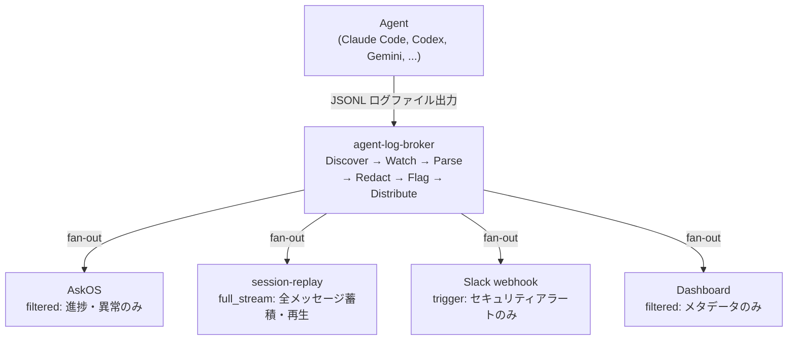
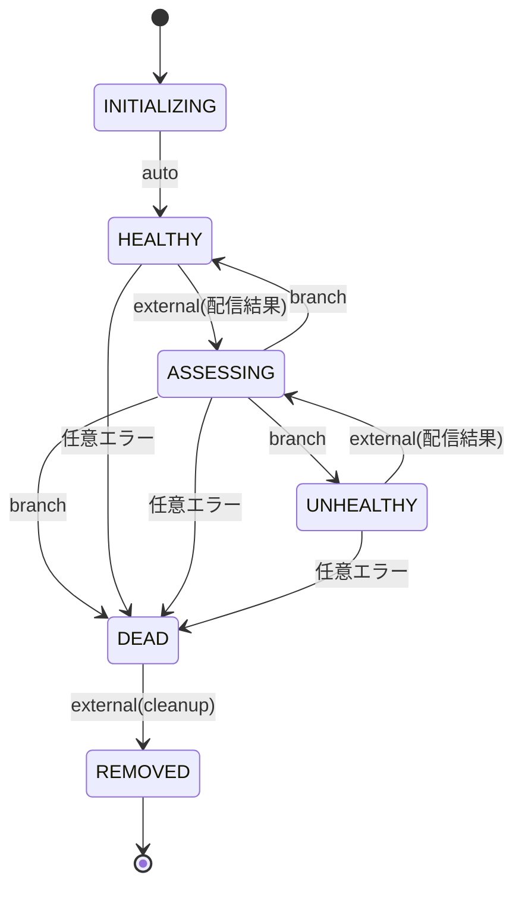

[English version](README.md)

# agent-log-broker

AskOS ワークスペースエコシステムの中央ログブローカー — Claude セッションログを複数コンシューマーへファンアウト配信する。

> **設計哲学: 「俺はパイプであって、裁判官じゃない」**
> Broker はログの内容を理解しない。受け取り、必要なら PII をマスクし、配信するだけ。

---

## 目次

- [何をするか](#何をするか)
- [エコシステムにおける位置づけ](#エコシステムにおける位置づけ)
- [サブスクリプションモード](#サブスクリプションモード) — full\_stream / filtered / trigger
- [コンシューマーライフサイクル](#コンシューマーライフサイクル) — tramli ステートマシン
- [tramli 統合](#tramli-統合)
- [session-replay / replayer 連携](#session-replay--replayer-連携)
- [既知の制限事項](#既知の制限事項)
- [開発](#開発)
- [ロードマップ](#ロードマップ)

---

## 何をするか

agent-log-broker の**設計目標**は、`~/.claude/projects/` 以下の JSONL ログファイルを監視し、各行を共通の `AgentMessage` モデルに変換、`BrokerEvent` エンベロープに包んで、登録済みコンシューマーのサブスクリプションモードに従いファンアウト配信することである。

現時点では、各構成要素は個別のモジュールとして存在するものの、**一気通貫のパイプラインとしてはまだ結線されていない**（下表の「状態」列および[既知の制限事項](#既知の制限事項) を参照）。

Broker の7つの責務と現在の実装状態:

| 責務 | 説明 | 状態 |
|---|---|---|
| Discover | ベースパス配下のエージェントログファイルを検出 | 実装済み（`FileWatcher.discoverSessions()`。symlink 解決は未対応） |
| Watch | `fs.watch` でファイル変更を検知 | 実装済み（`FileWatcher.watchSession()`） |
| Parse | 生 JSONL 行を `AgentMessage` に変換 | **未実装** — `AgentMessage` 型は定義済みだが、JSONL 行を変換するコードは存在しない。`watchSession()` は生文字列をそのまま `onLine` に渡す |
| Redact | PII をマスク（minimal / standard / strict） | 実装済み（`RedactionPipeline`: PII + 認証情報） |
| Flag | 危険コマンドと禁止語を検出 | **部分的** — 危険コマンド検出のみ。禁止語検出は未実装（語リストも走査処理も無い） |
| Distribute | マッチするコンシューマーへ `BrokerEvent` をファンアウト | **スタブ** — `distribute()` は `Promise.allSettled` でファンアウトするが、配信自体がスタブで、`SubscriptionManager.matches()` も redaction も適用しない |
| Offset Track | 各ファイルをどこまで読んだか記憶 | インメモリで実装済み（バイトオフセット。永続化は未対応） |

---

## エコシステムにおける位置づけ



> **結線状態**: この図は設計目標を示す。現在のコードでは各ステージは独立したモジュールとして存在するだけで、相互に結線されていない。`BrokerCore.distribute()` はパース・redaction・フラグ付与・`SubscriptionManager.matches()` のいずれも呼ばず、`Discover → Watch → Parse → Redact → Flag → Distribute` を端から端まで実行するオーケストレータ / `main` も存在しない。`src/index.ts` はモジュールを再エクスポートするだけ。上図の連鎖のうち、現状で実際に繋がっているのは `Discover → Watch`（`FileWatcher` 経由）のみ。

---

## サブスクリプションモード

### full\_stream

全セッションの全イベントを受け取る。`session-replay` が使用。

```json
{
  "consumerId": "session-replay",
  "callbackUrl": "http://localhost:4200/broker/events",
  "mode": "full_stream"
}
```

### filtered

プロジェクトパス・エージェント種別・ロール・フィールド条件に合致するイベントのみ受け取る。AskOS が使用。

```json
{
  "consumerId": "askos",
  "callbackUrl": "http://localhost:3000/broker/events",
  "mode": "filtered",
  "filter": {
    "projectPath": "/home/opa/work/my-project",
    "includeRoles": ["assistant"],
    "includeFields": ["toolUses", "text", "securityFlags"],
    "excludeFields": ["toolResults", "thinking"],
    "redactionLevel": "standard"
  }
}
```

> **注意**: `matchesFilter()` が現在評価するのは `projectPath` / `agentTypes` / `includeRoles` のみ。`includeFields` / `excludeFields`（フィールドの取捨）、`redactionLevel`（コンシューマーごとの redaction）、`minIntervalMs`（レート制限）は `FilterConfig` 型としては受け付けるが**まだ適用されない** — イベントのペイロードはそのまま素通しされる。

### trigger

特定条件に合致したときだけ発火。Slack webhook が使用。

```json
{
  "consumerId": "slack-security",
  "callbackUrl": "https://hooks.slack.com/...",
  "mode": "trigger",
  "trigger": {
    "conditions": [
      { "field": "securityFlags", "op": "not_empty" }
    ],
    "throttleSeconds": 300
  }
}
```

> **注意**: trigger 条件評価は現在の実装ではスタブ状態（Phase 2 作業）。

---

## コンシューマーライフサイクル

各コンシューマーのヘルス状態は [tramli](https://github.com/opaopa6969/tramli) ステートマシンで管理される:



`ASSESSING` でのブランチロジック:
- 配信成功 → `HEALTHY`（エラーカウントリセット）
- エラー数 < `errorThreshold`（デフォルト 3）→ `HEALTHY` を維持（エラーカウントインクリメント）
- エラー数 >= `errorThreshold` → `UNHEALTHY`
- エラー数 >= `maxRetries`（デフォルト 10）→ `DEAD`

ステートマシン全仕様は [docs/consumer-lifecycle.md](docs/consumer-lifecycle.md) を参照。

---

## tramli 統合

コンシューマーライフサイクルは tramli の `FlowDefinition<ConsumerState>` として実装されている。tramli がビルド時に保証するもの:

- 全ステートにプロセッサまたはガードが定義されている
- `flowKey` の依存関係が読み取り前に必ず満たされている
- 不正な遷移が構造的に存在できない

`ConsumerRegistry` は `InMemoryFlowStore` と共有 `FlowEngine` を使用する。登録された各コンシューマーは独自の `FlowInstance` を持つ。

```typescript
import { ConsumerRegistry } from "@unlaxer/agent-log-broker";

const registry = new ConsumerRegistry({ errorThreshold: 3, maxRetries: 10 });
const consumer = await registry.register("my-consumer", "http://localhost:9000/events");
// consumer.status === "HEALTHY"

await registry.recordDelivery("my-consumer", false); // ASSESSING をトリガー
```

---

## session-replay / replayer 連携

`session-replay`（claude-session-replay）はこのブローカーのファーストクラスコンシューマーとして動作する:

- **従来**: session-replay がログファイルを直接読み、独自のパース・オフセット管理をしていた。
- **今後**: Broker が検出・監視・パース・配信を担当し、session-replay は `BrokerEvent` を HTTP POST で受け取り、蓄積と UI に専念する。

ログフォーマットアダプター（`claude-log2model`、`codex-log2model` 等）は session-replay から Broker のアダプター層に移行する。

`BrokerEvent` スキーマ（`schemas/broker-event.schema.json`、JSON Schema Draft 2020-12）が Broker とコンシューマー間の契約。フィールド全仕様は [docs/architecture.md](docs/architecture.md) を参照。

---

## 既知の制限事項

| 制限事項 | 詳細 |
|---|---|
| パイプラインが一気通貫で結線されていない | `BrokerCore.distribute()` は `SubscriptionManager.matches()` も `RedactionPipeline` も呼ばない。watch → parse → redact → flag → match → distribute を束ねるオーケストレータ / `main` が無い。`src/index.ts` はモジュールを再エクスポートするだけ。 |
| Parse ステージが存在しない | JSONL 行を `AgentMessage` に変換するコードが無い。型は定義済みだが変換器は未実装。`FileWatcher` は生の行文字列を渡すだけ。 |
| `filtered` のフィールド取捨 / redaction が未適用 | `matchesFilter()` は `projectPath` / `agentTypes` / `includeRoles` のみ評価。`includeFields`・`excludeFields`・`redactionLevel`・`minIntervalMs` は適用されない。 |
| 禁止語フラグが未実装 | `RedactionPipeline` は危険コマンドと PII / 認証情報のみフラグ付与する。`banned_word` フラグ型と `bannedWordHits` フィールドは存在するが、語リストも検出コードも無い。 |
| `deliverToConsumer` はスタブ | HTTP POST 配信は未実装。現在は無条件で `success: true` を返す。Phase 1 作業。 |
| FileWatcher オフセットはインメモリ | プロセス再起動でオフセットが失われる。起動時にオフセット 0 からセッションが再読み込みされる。永続オフセットストアは Phase 2 作業。 |
| symlink 解決が未完成 | `discoverSessions()` は `projectPath` にディレクトリハッシュをそのまま返す。実際のプロジェクトパスへの symlink 解決は未実装。 |
| trigger 評価はスタブ | `matchesTrigger()` は常に `false` を返す。Phase 2 作業。 |

---

## 開発

```bash
npm install
npm run build       # TypeScript コンパイル
npm run dev         # 監視モード（tsx）
npm test            # Vitest
npm run typecheck   # tsc --noEmit
```

### プロジェクト構成

```
src/
├── broker/
│   ├── core.ts          # BrokerCore — ファンアウトエンジン
│   ├── subscription.ts  # SubscriptionManager + BrokerEvent 型定義
│   └── lifecycle.ts     # （予約）
├── consumers/
│   ├── types.ts         # Consumer, ConsumerState, DeliveryResult
│   ├── lifecycle.ts     # tramli FlowDefinition<ConsumerState>
│   └── registry.ts      # ConsumerRegistry（tramli バックエンド）
├── adapters/
│   └── file-watcher.ts  # FileWatcher — JSONL テールアダプター
├── security/
│   └── redaction.ts     # RedactionPipeline
└── index.ts             # 公開 API エクスポート

schemas/
└── broker-event.schema.json  # JSON Schema Draft 2020-12
```

---

## ロードマップ

### Phase 1 — ファイルウォッチャー + 基本ファンアウト（現在）

- [x] `FileWatcher` — `~/.claude/projects/` JSONL 監視
- [x] `BrokerCore.distribute()` — `Promise.allSettled` ファンアウト（配信はスタブ。フィルタ / redaction 未適用）
- [x] `SubscriptionManager` — full\_stream + filtered マッチング（filtered は project / agent / role のみ照合。フィールド取捨とコンシューマーごとの redaction は未適用）
- [x] `ConsumerRegistry` — tramli バックエンドライフサイクル
- [x] `RedactionPipeline` — PII / 認証情報マスク + 危険コマンドフラグ（禁止語フラグは未実装）
- [x] `BrokerEvent` JSON Schema（Draft 2020-12）
- [ ] Parse ステージ — JSONL 行 → `AgentMessage` 変換器（型は定義済み、変換器は未実装）
- [ ] パイプライン結線 — watch → parse → redact → flag → match → distribute を実行するオーケストレータ（構成要素は揃うが未結線。`index.ts` は再エクスポートのみ）
- [ ] `deliverToConsumer` — 実際の HTTP POST（現在スタブ）
- [ ] 永続オフセットストア

### Phase 2 — サブスクリプション管理 + セキュリティ

- [ ] trigger 条件評価
- [ ] DLQ（Dead Letter Queue）+ リトライ
- [ ] コンシューマーヘルスチェックエンドポイント
- [ ] 永続オフセットストア

### Phase 3 — エンタープライズ機能

- [ ] OIDC 認証
- [ ] Webhook 配信フォーマット（Slack テンプレート）
- [ ] auto-discover モード（全エージェント自動検出）
- [ ] キャッチアップ（過去ログ再送）
- [ ] 管理 API（`/api/status`、`/api/watch`、`/api/sessions`）

---

## ライセンス

UNLICENSED
