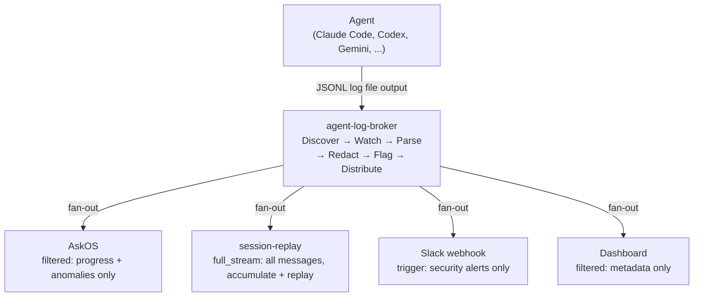
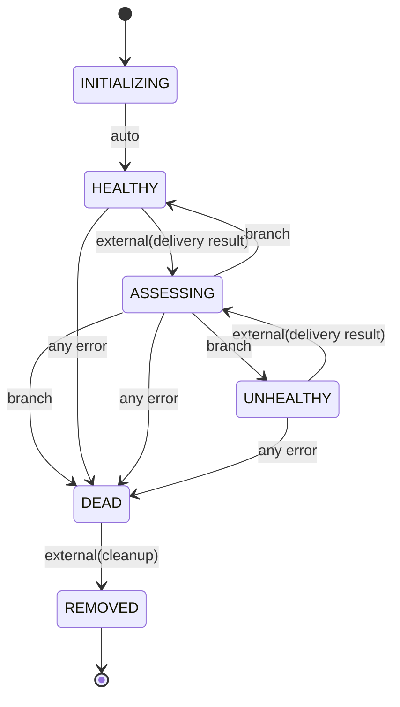

[日本語版はこちら / Japanese](README-ja.md)

# agent-log-broker

Central log broker for the AskOS workspace ecosystem — fan-out Claude session logs to multiple consumers.

> **Design principle: "I am a pipe, not a judge."**
> The broker does not understand log content. It receives, optionally redacts PII, and delivers. That is all.

---

## Table of Contents

- [What it does](#what-it-does)
- [Ecosystem position](#ecosystem-position)
- [Subscription modes](#subscription-modes) — full\_stream / filtered / trigger
- [Consumer lifecycle](#consumer-lifecycle) — tramli state machine
- [tramli integration](#tramli-integration)
- [session-replay / replayer integration](#session-replay--replayer-integration)
- [Known limitations](#known-limitations)
- [Development](#development)
- [Roadmap](#roadmap)

---

## What it does

agent-log-broker watches `~/.claude/projects/` for JSONL log files written by Claude Code (and future agents), parses each line into a common `AgentMessage` model, wraps it in a `BrokerEvent` envelope, and fans it out to registered consumers according to their subscription mode.

The broker's seven responsibilities:

| Responsibility | Description |
|---|---|
| Discover | Locate agent log files under the base path |
| Watch | Detect file changes via `fs.watch` |
| Parse | Convert raw JSONL lines to `AgentMessage` |
| Redact | Mask PII (minimal / standard / strict) |
| Flag | Detect dangerous commands and banned words |
| Distribute | Fan-out `BrokerEvent` to matching consumers |
| Offset Track | Remember how far each file has been read |

---

## Ecosystem position



---

## Subscription modes

### full\_stream

Receive every event from every session. Used by `session-replay`.

```json
{
  "consumerId": "session-replay",
  "callbackUrl": "http://localhost:4200/broker/events",
  "mode": "full_stream"
}
```

### filtered

Receive events matching project path, agent type, role, and field criteria. Used by AskOS.

```json
{
  "consumerId": "askos",
  "callbackUrl": "http://localhost:3000/broker/events",
  "mode": "filtered",
  "filter": {
    "projectPath": "/home/opa/work/my-project",
    "includeRoles": ["assistant"],
    "includeFields": ["toolUses", "text", "securityFlags"],
    "excludeFields": ["toolResults", "thinking"],
    "redactionLevel": "standard"
  }
}
```

### trigger

Fire only when specific conditions match. Used by Slack webhook.

```json
{
  "consumerId": "slack-security",
  "callbackUrl": "https://hooks.slack.com/...",
  "mode": "trigger",
  "trigger": {
    "conditions": [
      { "field": "securityFlags", "op": "not_empty" }
    ],
    "throttleSeconds": 300
  }
}
```

> **Note**: trigger condition evaluation is a stub in the current implementation (Phase 2 work).

---

## Consumer lifecycle

Each consumer's health is tracked by a [tramli](https://github.com/opaopa6969/tramli) state machine:



Branch logic in `ASSESSING`:
- Delivery success → `HEALTHY` (reset error count)
- Errors < `errorThreshold` (default 3) → stay `HEALTHY` (increment error count)
- Errors >= `errorThreshold` → `UNHEALTHY`
- Errors >= `maxRetries` (default 10) → `DEAD`

See [docs/consumer-lifecycle.md](docs/consumer-lifecycle.md) for the full state machine reference.

---

## tramli integration

The consumer lifecycle is implemented as a tramli `FlowDefinition<ConsumerState>`. tramli enforces at build time that:

- Every state has a defined processor or guard
- Every `flowKey` dependency is satisfied before it is read
- No invalid transitions can exist

The `ConsumerRegistry` uses `InMemoryFlowStore` and a single shared `FlowEngine`. Each registered consumer gets its own `FlowInstance`.

```typescript
import { ConsumerRegistry } from "@unlaxer/agent-log-broker";

const registry = new ConsumerRegistry({ errorThreshold: 3, maxRetries: 10 });
const consumer = await registry.register("my-consumer", "http://localhost:9000/events");
// consumer.status === "HEALTHY"

await registry.recordDelivery("my-consumer", false); // trigger ASSESSING
```

---

## session-replay / replayer integration

`session-replay` (claude-session-replay) is a first-class consumer of this broker:

- **Before**: session-replay read log files directly, maintaining its own parse and offset logic.
- **After**: The broker handles discovery, watching, parsing, and delivery. session-replay receives `BrokerEvent` objects via HTTP POST and focuses on accumulation and UI.

Log format adapters (`claude-log2model`, `codex-log2model`, etc.) migrate from session-replay into the broker's adapter layer.

The `BrokerEvent` schema (`schemas/broker-event.schema.json`, JSON Schema Draft 2020-12) is the contract between broker and consumers. See [docs/architecture.md](docs/architecture.md) for the full field reference.

---

## Known limitations

| Limitation | Detail |
|---|---|
| `deliverToConsumer` is a stub | HTTP POST delivery not yet implemented. Returns `success: true` unconditionally. Phase 1 work. |
| FileWatcher offsets are in-memory | Offsets are lost on process restart. A session will be re-read from offset 0 on startup. Persistent offset store is Phase 2 work. |
| Symlink resolution incomplete | `discoverSessions()` returns the raw directory hash as `projectPath`. Symlink resolution to the real project path is not yet implemented. |
| trigger evaluation is a stub | `matchesTrigger()` always returns `false`. Phase 2 work. |

---

## Development

```bash
npm install
npm run build       # TypeScript compile
npm run dev         # Watch mode (tsx)
npm test            # Vitest
npm run typecheck   # tsc --noEmit
```

### Project structure

```
src/
├── broker/
│   ├── core.ts          # BrokerCore — fan-out engine
│   ├── subscription.ts  # SubscriptionManager + BrokerEvent types
│   └── lifecycle.ts     # (reserved)
├── consumers/
│   ├── types.ts         # Consumer, ConsumerState, DeliveryResult
│   ├── lifecycle.ts     # tramli FlowDefinition<ConsumerState>
│   └── registry.ts      # ConsumerRegistry (tramli-backed)
├── adapters/
│   └── file-watcher.ts  # FileWatcher — JSONL tail adapter
├── security/
│   └── redaction.ts     # RedactionPipeline
└── index.ts             # Public API exports

schemas/
└── broker-event.schema.json  # JSON Schema Draft 2020-12
```

---

## Roadmap

### Phase 1 — File watcher + basic fan-out (current)

- [x] `FileWatcher` — `~/.claude/projects/` JSONL monitoring
- [x] `BrokerCore.distribute()` — fan-out with `Promise.allSettled`
- [x] `SubscriptionManager` — full\_stream + filtered matching
- [x] `ConsumerRegistry` — tramli-backed lifecycle
- [x] `RedactionPipeline` — PII masking + security flags
- [x] `BrokerEvent` JSON Schema (Draft 2020-12)
- [ ] `deliverToConsumer` — real HTTP POST (stub currently)
- [ ] Persistent offset store

### Phase 2 — Subscription management + security

- [ ] trigger condition evaluation
- [ ] DLQ (Dead Letter Queue) + retry
- [ ] Consumer health check endpoint
- [ ] Persistent offset store

### Phase 3 — Enterprise features

- [ ] OIDC authentication
- [ ] Webhook delivery formatting (Slack template)
- [ ] auto-discover mode (all agents)
- [ ] Catch-up (replay past logs)
- [ ] Management API (`/api/status`, `/api/watch`, `/api/sessions`)

---

## License

UNLICENSED
