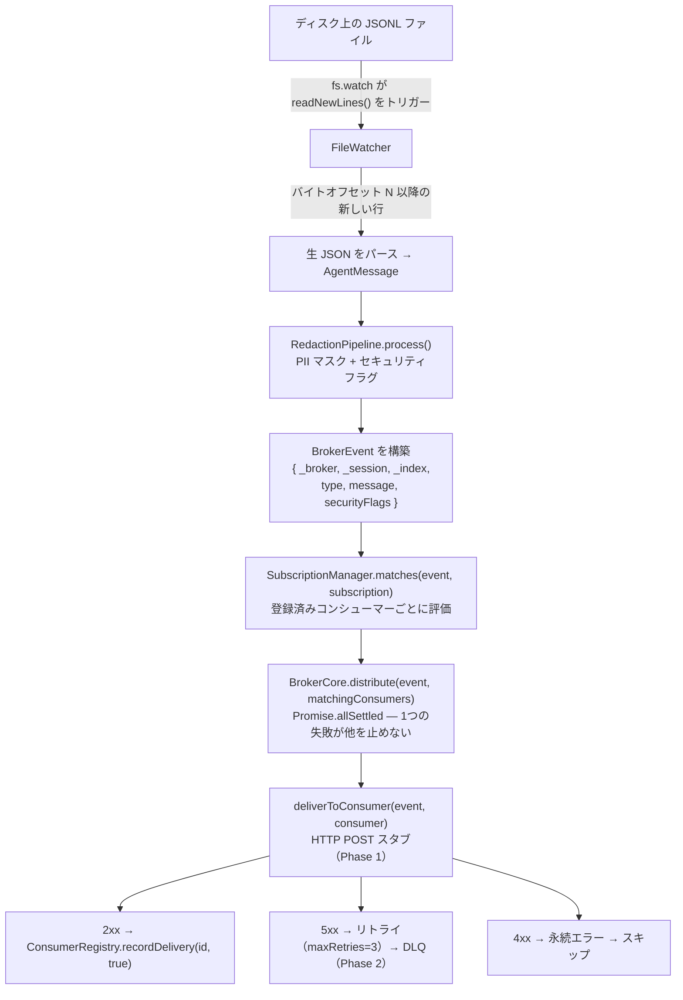

[English version](architecture.md)

# アーキテクチャ

## 設計原則

### 1. Broker はパイプである（BRK-PIPE）

Broker は7つの責務を軸に設計されている。ログの内容を理解せずルーティングするだけ。「担当」列は各責務を持つべきモジュールを示すが、いくつかは相互にまだ結線されていない（[データフロー](#データフロー) および [制限事項](#制限事項) 参照）。

| 責務 | 担当 | 状態 |
|---|---|---|
| ログファイルの検出 | `FileWatcher.discoverSessions()` | 実装済み（symlink 解決は未対応） |
| 変更の監視 | `FileWatcher.watchSession()` | 実装済み |
| JSONL 行のパース | アダプター層 | **未実装** — JSONL 行 → `AgentMessage` 変換器は存在しない。`watchSession()` は生文字列を渡す |
| PII のマスク | `RedactionPipeline` | 実装済み（ただし `distribute()` からは呼ばれない） |
| 危険コンテンツのフラグ付与 | `RedactionPipeline` | 危険コマンドのみ。禁止語フラグは未実装 |
| イベントの配信 | `BrokerCore.distribute()` | ファンアウトのループのみ。`matches()` も redaction も適用せず、配信はスタブ |
| 読み取りオフセットの追跡 | `FileWatcher`（インメモリ。[制限事項](#制限事項) 参照） | 実装済み（byte/char 不整合あり。制限事項参照） |

Broker が**やらないこと**:
- ログの永続化（コンシューマーの仕事）
- エージェントの制御（AskOS の仕事）
- UI 表示（session-replay の仕事）
- 判断・意思決定（コンシューマーの仕事）

### 2. エージェント非依存（BRK-AGENT-AGNOSTIC）

Broker はエージェントへの変更を一切要求しない。外部からログファイルを読むだけ。
新しいエージェントのサポートはアダプターを1つ書くだけで完了し、他は何も変わらない。

### 3. 障害分離

- Broker がクラッシュしても動作中のエージェントは影響を受けない — ログはファイルに蓄積される。
- 1つのコンシューマーの失敗が他のコンシューマーへの配信を止めない（`Promise.allSettled`）。
- 再起動時、Broker はオフセット 0 からセッションを再読み込みできる（永続オフセットストアは Phase 2）。

---

## モジュール構成

```
src/
├── broker/
│   ├── core.ts          # BrokerCore — ファンアウトエンジン
│   └── subscription.ts  # SubscriptionManager + 全型定義
├── consumers/
│   ├── types.ts         # Consumer, ConsumerState, DeliveryResult
│   ├── lifecycle.ts     # tramli FlowDefinition<ConsumerState>
│   └── registry.ts      # ConsumerRegistry（tramli バックエンド）
├── adapters/
│   └── file-watcher.ts  # FileWatcher（Claude JSONL アダプター）
└── security/
    └── redaction.ts     # RedactionPipeline

schemas/
└── broker-event.schema.json  # JSON Schema Draft 2020-12
```

---

## データフロー



> **結線状態**: この図は設計目標であって、現在のコードパスではない。現状で繋がっているのは `JSONL → FileWatcher` のみ。`Parse` ノードには実装が無く（JSONL → `AgentMessage` 変換器が無い）、`BrokerCore.distribute()` は呼び出し側が渡したコンシューマーリストに対して動くだけで、`Parse`・`RedactionPipeline.process()`・`SubscriptionManager.matches()` のいずれも**呼ばない**。これらのノードを結ぶオーケストレータ / `main` は存在せず、`src/index.ts` はモジュールを再エクスポートするだけ。

---

## BrokerCore

`src/broker/core.ts`

ファンアウトエンジン。ステートレス — 設定のみを保持する。

```typescript
class BrokerCore {
  distribute(event: BrokerEvent, consumers: readonly Consumer[]): Promise<Map<string, DeliveryResult>>
}
```

`distribute()` は `Promise.allSettled` で各コンシューマーへの `deliverToConsumer()` を並行実行する。

> **現在の制限**: `deliverToConsumer` は HTTP リクエストを一切行わず `{ success: true }` を返すスタブ。実際の配信は Phase 1 で実装予定。

### BrokerCoreOptions

| オプション | デフォルト | 説明 |
|---|---|---|
| `maxRetries` | 3 | DLQ 移行前の最大配信試行回数 |
| `retryBackoffMs` | 1000 | 指数バックオフのベース（ミリ秒） |
| `deliveryTimeoutMs` | 5000 | リクエストごとのタイムアウト（ミリ秒） |

---

## FileWatcher

`src/adapters/file-watcher.ts`

`~/.claude/projects/**` の JSONL ログファイルを監視する。エージェント非依存 — エージェントの協力なしにファイルを読む。

```typescript
class FileWatcher {
  discoverSessions(): Promise<DiscoveredSession[]>
  watchSession(sessionPath: string, onLine: (line: string, offset: number) => void): void
  unwatchSession(sessionPath: string): void
  close(): void
}
```

### 期待するディレクトリ構成

```
~/.claude/projects/
  <hash>/                  ← URL エンコードされたプロジェクトパスのハッシュ
    sessions/
      <sessionId>/
        log.jsonl          ← 監視対象ファイル
```

### オフセット追跡

オフセット（バイト位置）はセッションパスをキーとする `Map<string, number>` でインメモリ保存される。**プロセス再起動でリセットされる。** 再起動後は全セッションがオフセット 0 から再読み込みされる。

> **既知の制限**: ファイルまたは DB への永続オフセットストアは Phase 2 作業。

### symlink 解決

`discoverSessions()` は現在 `projectPath` に生のディレクトリハッシュを返す。このハッシュは実際のプロジェクトパスを URL エンコードしたもの（例: `/home/opa/work/my-project` → `-home-opa-work-my-project`）。

> **既知の制限**: 人間が読めるプロジェクトパスへの symlink 解決は未実装。

---

## Consumer

Consumer インターフェースとライフサイクル状態。

```typescript
interface Consumer {
  id: string;
  callbackUrl: string;
  status: ConsumerState;      // tramli ステートマシンが管理
  messagesDelivered: number;
  lastDelivery: string | null;
  errors: number;
}

type ConsumerState =
  | "INITIALIZING"  // 登録直後
  | "HEALTHY"       // 正常に配信を受け取っている
  | "ASSESSING"     // ブランチ評価中（一時的な状態）
  | "UNHEALTHY"     // エラー率がしきい値を超えた
  | "DEAD"          // 最大リトライ回数を超えた
  | "REMOVED";      // クリーンアップ完了（終端）
```

### tramli ステートマシン

`ConsumerState` ライフサイクルは tramli `FlowDefinition`。各コンシューマーは `InMemoryFlowStore` に独自の `FlowInstance` を持つ。

ステートマシン全仕様: [docs/consumer-lifecycle.md](consumer-lifecycle.md)

---

## BrokerEvent スキーマ

`schemas/broker-event.schema.json` — JSON Schema Draft 2020-12

コンシューマーへ配信される全イベントはこのエンベロープに包まれる。

### トップレベルフィールド

| フィールド | 必須 | 型 | 説明 |
|---|---|---|---|
| `_broker` | yes | object | Broker エンベロープメタデータ |
| `_session` | yes | object | セッション識別情報 |
| `_index` | no | object | ログファイル内の位置 |
| `type` | yes | string | イベント種別 |
| `message` | no | object | エージェントメッセージ（`type === "message"` のとき存在） |
| `securityFlags` | no | array | セキュリティフラグオブジェクト配列 |
| `bannedWordHits` | no | array | 禁止語ヒットオブジェクト配列 |

### `_broker` フィールド

| フィールド | 型 | 説明 |
|---|---|---|
| `version` | `"1.0"` | スキーマバージョン（const） |
| `messageId` | string | 配信ごとの UUID |
| `deliveredAt` | date-time | ISO 8601 配信タイムスタンプ |
| `deliveryAttempt` | integer ≥ 1 | 試行回数（1 = 初回） |

### `_session` フィールド

| フィールド | 型 | 説明 |
|---|---|---|
| `sessionId` | string | 一意のセッション識別子 |
| `sessionPath` | string | log.jsonl への絶対パス |
| `projectPath` | string | プロジェクトパス（symlink 解決実装までハッシュ文字列） |
| `agentType` | string | `"claude"`（拡張可能） |

### `_index` フィールド

| フィールド | 型 | 説明 |
|---|---|---|
| `messageIndex` | integer ≥ 0 | ファイル内の 0 始まり行番号 |
| `byteOffset` | integer ≥ 0 | この行の先頭バイトオフセット |

### `type` の値

| 値 | 発火タイミング |
|---|---|
| `message` | 新しい JSONL 行がパースされた |
| `session.discovered` | 新しいセッションファイルが検出された |
| `session.idle` | N 分間ファイルが更新されていない |
| `session.lost` | ファイルが削除または移動された |

### `message` フィールド

| フィールド | 型 | 説明 |
|---|---|---|
| `role` | `"user"` \| `"assistant"` \| `"system"` | メッセージの送信者 |
| `text` | string | テキスト内容（マスク済みの可能性あり） |
| `toolUses` | array | ツール呼び出しオブジェクト |
| `toolResults` | array | ツール結果オブジェクト |
| `thinking` | string[] | 拡張思考ブロック |
| `timestamp` | date-time | 元のメッセージタイムスタンプ |

---

## サブスクリプションモード

### full\_stream

フィルタなし。全セッションの全イベントが配信される。session-replay が使用。

### filtered

以下の全条件に合致するイベントのみ配信:

- `projectPath` — `_session.projectPath` との完全一致（実装済み）
- `agentTypes` — `_session.agentType` がリスト内に含まれる（実装済み）
- `includeRoles` — `message.role` がリスト内に含まれる（実装済み）
- `includeFields` / `excludeFields` — ペイロードフィールドの投影（未適用。Phase 2）
- `redactionLevel` — このコンシューマー用の Redaction レベル上書き（未適用。`matchesFilter()` は無視する）
- `minIntervalMs` — 配信間の最小間隔（未適用）

### trigger

> **現在の制限**: trigger 条件評価は未実装（`matchesTrigger()` は常に `false` を返す）。Phase 2 作業。

想定動作: `conditions` が true と評価されたときのみ配信。`throttleSeconds` と `cooldownPerSession` のオプションサポート。

---

## Redaction レベル

| レベル | 適用パターン |
|---|---|
| `minimal` | PII のみ: email、電話番号（米国 + 日本）、SSN |
| `standard` | PII + 認証情報: AWS キー、汎用 secret/token/password |
| `strict` | PII + 認証情報 + ファイルパス（Phase 2） |

セキュリティフラグは全レベルで生成される（危険コマンド検出はマスクせずフラグ付与のみ）。

---

## 制限事項

| 制限事項 | 影響 | 対応予定 |
|---|---|---|
| パイプライン未結線 | `distribute()` は `matches()` も `RedactionPipeline` も呼ばず、データフローの各ステージを繋ぐオーケストレータが無い（`index.ts` は再エクスポートのみ） | Phase 1 |
| Parse ステージ欠落 | JSONL → `AgentMessage` 変換器が無く、`FileWatcher` は生の行を渡す | Phase 1 |
| `filtered` の投影 / redaction 未適用 | `includeFields`・`excludeFields`・`redactionLevel`・`minIntervalMs` を `matchesFilter()` が無視 | Phase 2 |
| 禁止語フラグ未実装 | `banned_word` / `bannedWordHits` は定義済みだが語リストも検出も無い | Phase 2 |
| `deliverToConsumer` スタブ | コンシューマーにイベントが届かない | Phase 1 |
| インメモリオフセット | 再起動時にセッションが先頭から再読み込みされる | Phase 2 |
| オフセットの byte/char 不整合 | `readNewLines()` は UTF-16 コード単位で切りつつオフセットを `Buffer.byteLength() + 1`（バイト）で加算。マルチバイトでズレる | コード側のバグと推測 |
| symlink 解決未実装 | `projectPath` がハッシュ文字列になる | Phase 2 |
| trigger 評価スタブ | trigger コンシューマーが発火しない | Phase 2 |
