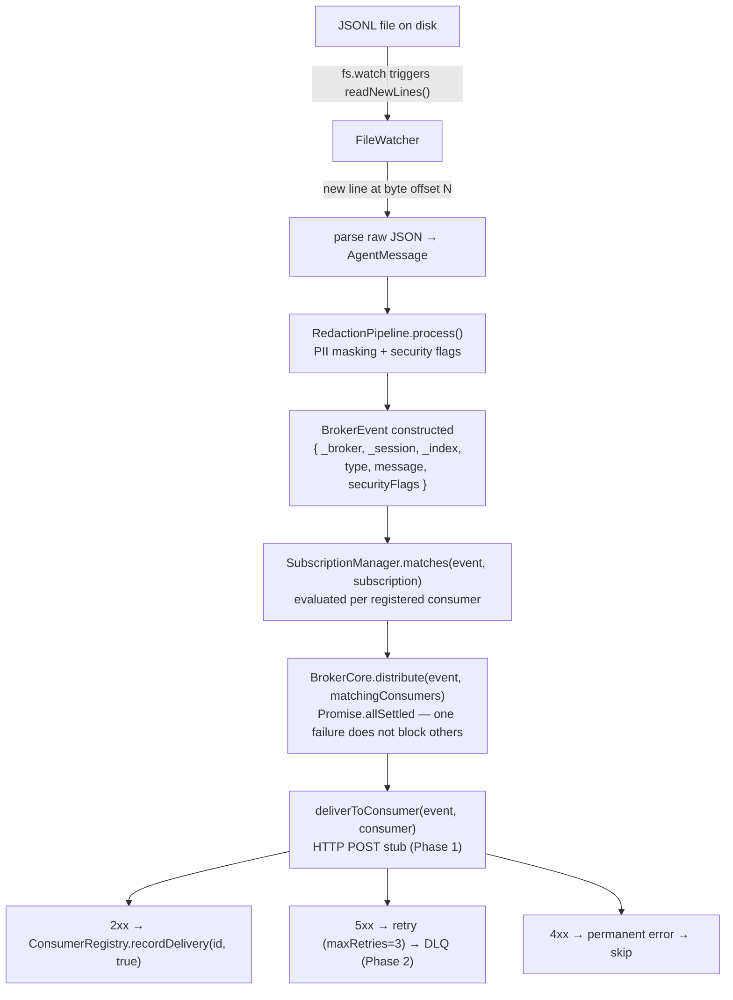

[日本語版はこちら / Japanese](architecture-ja.md)

# Architecture

## Design principles

### 1. The broker is a pipe (BRK-PIPE)

The broker is designed around exactly seven responsibilities. It does not understand log content — it routes it. The "Owner" column names the module intended to hold each responsibility; several are not yet connected to one another (see [Data flow](#data-flow) and [Limitations](#limitations)).

| Responsibility | Owner | Status |
|---|---|---|
| Discover log files | `FileWatcher.discoverSessions()` | Implemented (symlink resolution pending) |
| Watch for changes | `FileWatcher.watchSession()` | Implemented |
| Parse JSONL lines | adapter layer | **Not implemented** — no JSONL line → `AgentMessage` converter exists; `watchSession()` emits the raw string |
| Redact PII | `RedactionPipeline` | Implemented (but not invoked by `distribute()`) |
| Flag dangerous content | `RedactionPipeline` | Dangerous commands only; banned-word flagging not implemented |
| Distribute events | `BrokerCore.distribute()` | Fan-out loop only; does not apply `matches()` or redaction, and delivery is a stub |
| Track read offsets | `FileWatcher` (in-memory, see [Limitations](#limitations)) | Implemented with byte offsets |

What the broker does **not** do:
- Persist logs (consumer's job)
- Control agents (AskOS's job)
- Render UI (session-replay's job)
- Make decisions (consumer's job)

### 2. Agent-agnostic (BRK-AGENT-AGNOSTIC)

The broker requires zero changes to agents. It reads log files from the outside.
Adding support for a new agent means writing one adapter — nothing else changes.

### 3. Fault isolation

- A broker crash does not affect running agents — logs accumulate in files.
- One consumer failure does not block delivery to other consumers (`Promise.allSettled`).
- On restart, the broker can re-read sessions from offset 0 (persistent offset store is Phase 2).

---

## Module structure

```
src/
├── broker/
│   ├── core.ts          # BrokerCore — fan-out engine
│   └── subscription.ts  # SubscriptionManager + all type definitions
├── consumers/
│   ├── types.ts         # Consumer, ConsumerState, DeliveryResult
│   ├── lifecycle.ts     # tramli FlowDefinition<ConsumerState>
│   └── registry.ts      # ConsumerRegistry (tramli-backed)
├── adapters/
│   └── file-watcher.ts  # FileWatcher (Claude JSONL adapter)
└── security/
    └── redaction.ts     # RedactionPipeline

schemas/
└── broker-event.schema.json  # JSON Schema Draft 2020-12
```

---

## Data flow



> **Wiring status**: This diagram is the target design, not the current code path. Today only `JSONL → FileWatcher` is connected. The `Parse` node has no implementation (no JSONL → `AgentMessage` converter), and `BrokerCore.distribute()` is invoked with a caller-supplied consumer list — it does **not** call `Parse`, `RedactionPipeline.process()`, or `SubscriptionManager.matches()`. No orchestrator / `main` connects these nodes; `src/index.ts` only re-exports the modules.

---

## BrokerCore

`src/broker/core.ts`

The fan-out engine. Stateless — it holds configuration only.

```typescript
class BrokerCore {
  distribute(event: BrokerEvent, consumers: readonly Consumer[]): Promise<Map<string, DeliveryResult>>
}
```

`distribute()` calls `deliverToConsumer()` for each consumer concurrently via `Promise.allSettled`.

> **Current limitation**: `deliverToConsumer` is a stub that returns `{ success: true }` without making any HTTP request. Real delivery will be implemented in Phase 1.

### BrokerCoreOptions

| Option | Default | Description |
|---|---|---|
| `maxRetries` | 3 | Max delivery attempts before DLQ |
| `retryBackoffMs` | 1000 | Exponential backoff base (ms) |
| `deliveryTimeoutMs` | 5000 | Per-request timeout (ms) |

---

## FileWatcher

`src/adapters/file-watcher.ts`

Watches `~/.claude/projects/**` for JSONL log files. Agent-agnostic — reads files without any agent cooperation.

```typescript
class FileWatcher {
  discoverSessions(): Promise<DiscoveredSession[]>
  watchSession(sessionPath: string, onLine: (line: string, offset: number) => void): void
  unwatchSession(sessionPath: string): void
  close(): void
}
```

### Directory layout expected

```
~/.claude/projects/
  <hash>/                  ← URL-encoded project path hash
    sessions/
      <sessionId>/
        log.jsonl          ← watched file
```

### Offset tracking

Offsets (byte positions) are stored in `Map<string, number>` keyed by session path. **This is in-memory only.** On process restart, offsets reset to 0 and all sessions are re-read from the beginning.

> **Known limitation**: Persistent offset store (file or DB) is Phase 2 work.

### Symlink resolution

`discoverSessions()` currently returns the raw directory hash as `projectPath`. The hash is a URL-encoded form of the actual project path (e.g. `/home/opa/work/my-project` → `-home-opa-work-my-project`).

> **Known limitation**: Symlink resolution to the human-readable project path is not yet implemented.

---

## Consumer

Consumer interface and lifecycle state.

```typescript
interface Consumer {
  id: string;
  callbackUrl: string;
  status: ConsumerState;      // managed by tramli state machine
  messagesDelivered: number;
  lastDelivery: string | null;
  errors: number;
}

type ConsumerState =
  | "INITIALIZING"  // just registered
  | "HEALTHY"       // receiving deliveries
  | "ASSESSING"     // branch evaluation (transient)
  | "UNHEALTHY"     // error rate above threshold
  | "DEAD"          // max retries exceeded
  | "REMOVED";      // cleanup complete (terminal)
```

### tramli state machine

The `ConsumerState` lifecycle is a tramli `FlowDefinition`. Each consumer gets its own `FlowInstance` in `InMemoryFlowStore`.

Full state machine documentation: [docs/consumer-lifecycle.md](consumer-lifecycle.md)

---

## BrokerEvent schema

`schemas/broker-event.schema.json` — JSON Schema Draft 2020-12

Every event delivered to consumers is wrapped in this envelope.

### Top-level fields

| Field | Required | Type | Description |
|---|---|---|---|
| `_broker` | yes | object | Broker envelope metadata |
| `_session` | yes | object | Session identification |
| `_index` | no | object | Position in the log file |
| `type` | yes | string | Event type |
| `message` | no | object | Agent message (present when `type === "message"`) |
| `securityFlags` | no | array | Security flag objects |
| `bannedWordHits` | no | array | Banned word hit objects |

### `_broker` fields

| Field | Type | Description |
|---|---|---|
| `version` | `"1.0"` | Schema version (const) |
| `messageId` | string | UUID per delivery |
| `deliveredAt` | date-time | ISO 8601 delivery timestamp |
| `deliveryAttempt` | integer ≥ 1 | Attempt number (1 = first try) |

### `_session` fields

| Field | Type | Description |
|---|---|---|
| `sessionId` | string | Unique session identifier |
| `sessionPath` | string | Absolute path to log.jsonl |
| `projectPath` | string | Project path (hash until symlink resolution is implemented) |
| `agentType` | string | `"claude"` (extensible) |

### `_index` fields

| Field | Type | Description |
|---|---|---|
| `messageIndex` | integer ≥ 0 | Zero-based line number in the file |
| `byteOffset` | integer ≥ 0 | Byte offset at start of this line |

### `type` values

| Value | When emitted |
|---|---|
| `message` | A new JSONL line was parsed |
| `session.discovered` | A new session file was found |
| `session.idle` | File not updated for N minutes |
| `session.lost` | File was deleted or moved |

### `message` fields

| Field | Type | Description |
|---|---|---|
| `role` | `"user"` \| `"assistant"` \| `"system"` | Message author |
| `text` | string | Text content (may be redacted) |
| `toolUses` | array | Tool call objects |
| `toolResults` | array | Tool result objects |
| `thinking` | string[] | Extended thinking blocks |
| `timestamp` | date-time | Original message timestamp |

---

## Subscription modes

### full\_stream

No filtering. Every event from every session is delivered. Used by session-replay.

### filtered

Events are delivered only when they match all present filter criteria:

- `projectPath` — exact match on `_session.projectPath` (implemented)
- `agentTypes` — `_session.agentType` must be in the list (implemented)
- `includeRoles` — `message.role` must be in the list (implemented)
- `includeFields` / `excludeFields` — payload field projection (not yet applied; Phase 2)
- `redactionLevel` — override redaction level for this consumer (not yet applied; `matchesFilter()` ignores it)
- `minIntervalMs` — minimum interval between deliveries (not yet applied)

### trigger

> **Current limitation**: Trigger condition evaluation is not yet implemented (`matchesTrigger()` always returns `false`). Phase 2 work.

Intended behavior: deliver only when `conditions` evaluate to true, with optional `throttleSeconds` and `cooldownPerSession`.

---

## Redaction levels

| Level | Patterns applied |
|---|---|
| `minimal` | PII only: email, phone (US + JP), SSN |
| `standard` | PII + credentials: AWS key, generic secret/token/password |
| `strict` | PII + credentials + file paths (Phase 2) |

Security flags are generated at all levels (dangerous command detection does not redact — it flags).

---

## Limitations

| Limitation | Impact | Planned fix |
|---|---|---|
| Pipeline not wired | `distribute()` calls neither `matches()` nor `RedactionPipeline`; no orchestrator connects the data-flow stages (`index.ts` only re-exports) | Phase 1 |
| Parse stage missing | No JSONL → `AgentMessage` converter; `FileWatcher` emits the raw line | Phase 1 |
| `filtered` projection / redaction not applied | `includeFields`, `excludeFields`, `redactionLevel`, `minIntervalMs` ignored by `matchesFilter()` | Phase 2 |
| Banned-word flagging not implemented | `banned_word` / `bannedWordHits` defined but no word list or detection | Phase 2 |
| `deliverToConsumer` stub | No events reach consumers | Phase 1 |
| In-memory offsets | Sessions re-read from start on restart | Phase 2 |
| Symlink resolution missing | `projectPath` is a hash string | Phase 2 |
| trigger evaluation stub | trigger consumers never fire | Phase 2 |
