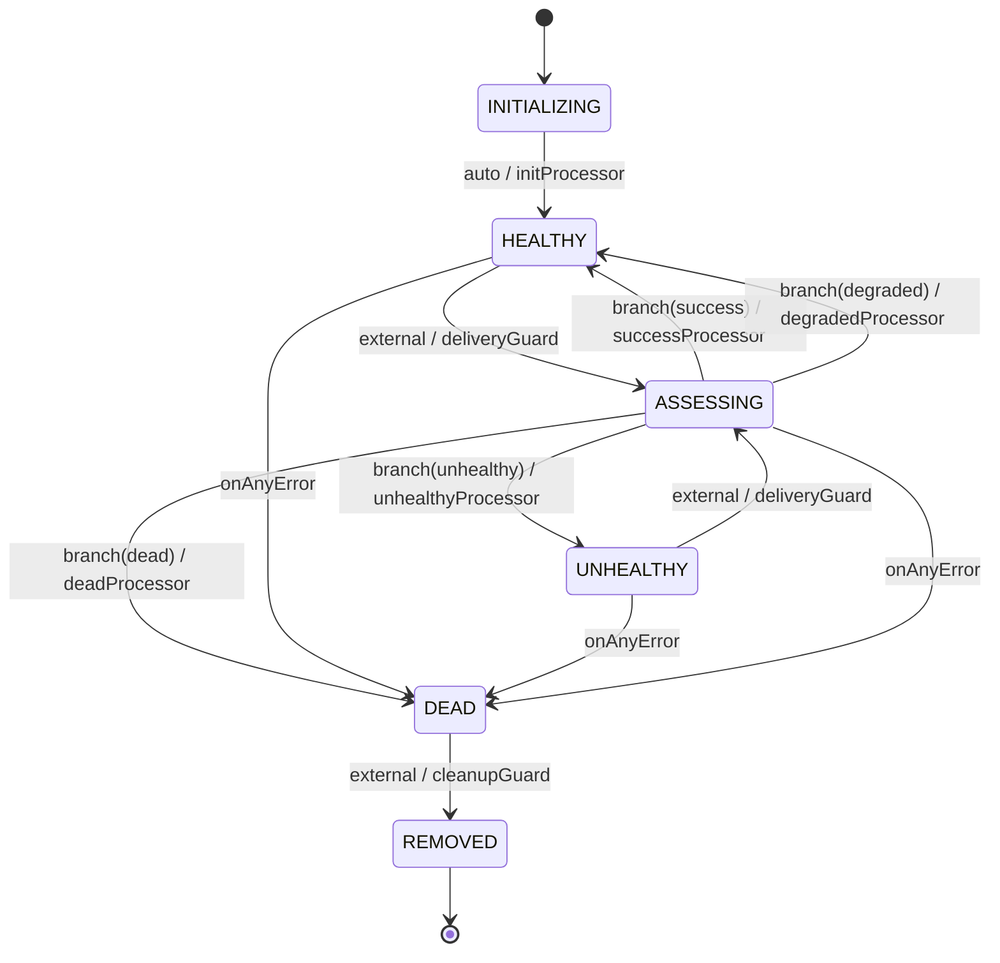

[English version](consumer-lifecycle.md)

# コンシューマーライフサイクル

登録された各コンシューマーのヘルス状態は [tramli](https://github.com/opaopa6969/tramli) ステートマシンで管理される。このドキュメントはそのステートマシンの完全なリファレンス。

---

## 状態図



---

## 状態一覧

| 状態 | 意味 | 終端 |
|---|---|---|
| `INITIALIZING` | 登録直後。最初の auto 遷移待ち。 | no |
| `HEALTHY` | 配信を受け取っている。エラーカウントがしきい値以下またはゼロ。 | no |
| `ASSESSING` | ブランチ評価中。一時的な状態 — 外部からは長時間観察されない。 | no |
| `UNHEALTHY` | エラー率が `errorThreshold` を超えた。配信は継続するが、フラグが立つ。 | no |
| `DEAD` | エラーカウントが `maxRetries` に達した。配信停止。 | no |
| `REMOVED` | クリーンアップ完了。コンシューマーレコードを安全に破棄できる。 | **yes** |

---

## 遷移

### INITIALIZING → HEALTHY（auto）

`startFlow()` 実行後に即座に発火。外部入力は不要。

**プロセッサ**: `initProcessor`
- `produces`: `errorCount = 0`、`messagesDelivered = 0`、`lastDelivery = null`

---

### HEALTHY / UNHEALTHY → ASSESSING（external）

`ConsumerRegistry.recordDelivery(id, success)` が呼ばれたときに発火。

**ガード**: `deliveryGuard`
- `requires`: `deliverySuccess`（`externallyProvided` で外部から注入）
- 常に受け付ける（拒否ロジックなし）

---

### ASSESSING → branch

`BranchProcessor` の `assessBranch` が `deliverySuccess` と `errorCount` を読み取って次の状態を決定する。

```
decide(ctx):
  if deliverySuccess            → "success"
  else if errors + 1 >= maxRetries      → "dead"
  else if errors + 1 >= errorThreshold  → "unhealthy"
  else                          → "degraded"
```

| ブランチラベル | 次の状態 | プロセッサ |
|---|---|---|
| `"success"` | `HEALTHY` | `successProcessor` — `errorCount` リセット、`messagesDelivered` インクリメント、`lastDelivery` 更新 |
| `"degraded"` | `HEALTHY` | `degradedProcessor` — `errorCount` のみインクリメント |
| `"unhealthy"` | `UNHEALTHY` | `unhealthyProcessor` — `errorCount` インクリメント |
| `"dead"` | `DEAD` | `deadProcessor` — `errorCount` インクリメント |

---

### DEAD → REMOVED（external）

`ConsumerRegistry.remove(id)` が呼ばれたときに発火。`DEAD` 状態からのみ許可される。

**ガード**: `cleanupGuard`
- 常に受け付ける

---

### 任意 → DEAD（onAnyError）

プロセッサまたはガードがハンドルされない例外をスローした場合、現在の状態に関係なくフローが `DEAD` へ遷移する。これは tramli の `onAnyError()` ディレクティブ。

---

## 設定

`LifecycleConfig` は `ConsumerRegistry` コンストラクターと `buildConsumerLifecycle()` に渡す。

| オプション | デフォルト | 説明 |
|---|---|---|
| `errorThreshold` | 3 | `UNHEALTHY` をトリガーする連続エラー数 |
| `maxRetries` | 10 | `DEAD` をトリガーする累積エラー数 |

```typescript
const registry = new ConsumerRegistry({
  errorThreshold: 5,
  maxRetries: 20,
});
```

---

## FlowContext キー

| キー | 型 | セット元 | 説明 |
|---|---|---|---|
| `deliverySuccess` | `boolean` | 外部（`recordDelivery` 経由） | 最後の配信試行が成功したかどうか |
| `errorCount` | `number` | プロセッサ | 累積連続エラー数 |
| `messagesDelivered` | `number` | `successProcessor` | 成功した配信の総数 |
| `lastDelivery` | `string \| null` | `successProcessor` | 最後の成功の ISO 8601 タイムスタンプ |

---

## tramli 統合の詳細

ライフサイクルは `src/consumers/lifecycle.ts` で `Tramli.define<ConsumerState>()` を使って定義されている。

使用している主な tramli 機能:

- **`externallyProvided(DELIVERY_SUCCESS)`** — `deliverySuccess` がプロセッサではなく呼び出し元から注入されることを宣言
- **`.auto()`** — `INITIALIZING → HEALTHY` が即座に発火（外部トリガー不要）
- **`.external()`** — `HEALTHY/UNHEALTHY → ASSESSING` が `resumeAndExecute()` 呼び出しを待つ
- **`.branch()`** — `ASSESSING` が `assessBranch.decide()` を評価して4つのターゲットのどれかにルーティング
- **`.onAnyError("DEAD")`** — キャッチされない例外がコンシューマーを `DEAD` に送る
- **`InMemoryFlowStore`** — 各コンシューマーの `FlowInstance` がプロセス内に保存される

tramli のコンセプト: [tramli README](https://github.com/opaopa6969/tramli) を参照。

---

## サブスクリプションモードとライフサイクルの関係

3つのサブスクリプションモード（`full_stream`、`filtered`、`trigger`）はいずれも同じライフサイクルステートマシンを使用する。モードは**何を**配信するかを決定し、ライフサイクルは配信を**試みるかどうか**を決定する。

| コンシューマー状態 | 配信試行 |
|---|---|
| `INITIALIZING` | なし（最初の配信より前に auto 遷移が発火） |
| `HEALTHY` | あり |
| `ASSESSING` | なし（一時的） |
| `UNHEALTHY` | あり（Broker は試行を継続するがフラグが立つ） |
| `DEAD` | なし |
| `REMOVED` | なし |
