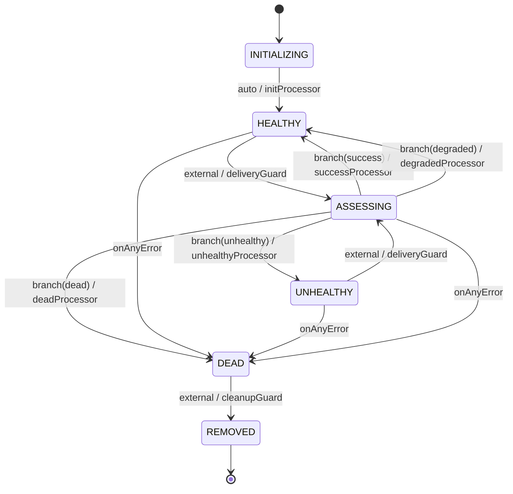

[日本語版はこちら / Japanese](consumer-lifecycle-ja.md)

# Consumer Lifecycle

Each registered consumer's health is tracked by a [tramli](https://github.com/opaopa6969/tramli) state machine. This document is the complete reference for that state machine.

---

## State diagram

```
INITIALIZING ──auto──────────────────────────────────> HEALTHY
                                                           │
HEALTHY      ──external(delivery result)──> ASSESSING ────┤
                                               branch      │
UNHEALTHY    ──external(delivery result)──> ASSESSING ─── ┤
                                                           │
                                                   ┌───────┴───────┐
                                                   ▼               ▼
                                               HEALTHY         UNHEALTHY
                                                                   │
                                                               DEAD ◄──── any error (onAnyError)
                                                               │
                                                         REMOVED (terminal)
                                                   DEAD ──external(cleanup)──>
```

Mermaid:



---

## States

| State | Meaning | Terminal |
|---|---|---|
| `INITIALIZING` | Consumer just registered. Awaiting first auto-transition. | no |
| `HEALTHY` | Receiving deliveries. Error count is below threshold or zero. | no |
| `ASSESSING` | Branch evaluation in progress. Transient — never observed externally for long. | no |
| `UNHEALTHY` | Error rate is above `errorThreshold`. Delivery continues, but consumer is flagged. | no |
| `DEAD` | Error count reached `maxRetries`. Delivery halted. | no |
| `REMOVED` | Cleanup complete. Consumer record can be safely discarded. | **yes** |

---

## Transitions

### INITIALIZING → HEALTHY (auto)

Fires immediately on `startFlow()`. No external input needed.

**Processor**: `initProcessor`
- `produces`: `errorCount = 0`, `messagesDelivered = 0`, `lastDelivery = null`

---

### HEALTHY / UNHEALTHY → ASSESSING (external)

Fires when `ConsumerRegistry.recordDelivery(id, success)` is called.

**Guard**: `deliveryGuard`
- `requires`: `deliverySuccess` (provided externally via `externallyProvided`)
- Always accepts (no rejection logic)

---

### ASSESSING → branch

`BranchProcessor` `assessBranch` reads `deliverySuccess` and `errorCount` to decide the next state.

```
decide(ctx):
  if deliverySuccess    → "success"
  else if errors + 1 >= maxRetries   → "dead"
  else if errors + 1 >= errorThreshold → "unhealthy"
  else                  → "degraded"
```

| Branch label | Next state | Processor |
|---|---|---|
| `"success"` | `HEALTHY` | `successProcessor` — reset `errorCount`, increment `messagesDelivered`, update `lastDelivery` |
| `"degraded"` | `HEALTHY` | `degradedProcessor` — increment `errorCount` only |
| `"unhealthy"` | `UNHEALTHY` | `unhealthyProcessor` — increment `errorCount` |
| `"dead"` | `DEAD` | `deadProcessor` — increment `errorCount` |

---

### DEAD → REMOVED (external)

Fires when `ConsumerRegistry.remove(id)` is called. Only allowed from `DEAD` state.

**Guard**: `cleanupGuard`
- Always accepts

---

### any → DEAD (onAnyError)

If any processor or guard throws an unhandled exception, the flow transitions to `DEAD` regardless of the current state. This is tramli's `onAnyError()` directive.

---

## Configuration

`LifecycleConfig` is passed to `ConsumerRegistry` constructor and `buildConsumerLifecycle()`.

| Option | Default | Description |
|---|---|---|
| `errorThreshold` | 3 | Consecutive error count that triggers `UNHEALTHY` |
| `maxRetries` | 10 | Total error count that triggers `DEAD` |

```typescript
const registry = new ConsumerRegistry({
  errorThreshold: 5,
  maxRetries: 20,
});
```

---

## FlowContext keys

| Key | Type | Set by | Description |
|---|---|---|---|
| `deliverySuccess` | `boolean` | external (via `recordDelivery`) | Whether the last delivery attempt succeeded |
| `errorCount` | `number` | processors | Cumulative consecutive errors |
| `messagesDelivered` | `number` | `successProcessor` | Total successful deliveries |
| `lastDelivery` | `string \| null` | `successProcessor` | ISO 8601 timestamp of last success |

---

## tramli integration details

The lifecycle is defined in `src/consumers/lifecycle.ts` using `Tramli.define<ConsumerState>()`.

Key tramli features used:

- **`externallyProvided(DELIVERY_SUCCESS)`** — declares that `deliverySuccess` is injected by the caller, not produced by a processor
- **`.auto()`** — `INITIALIZING → HEALTHY` fires immediately, no external trigger needed
- **`.external()`** — `HEALTHY/UNHEALTHY → ASSESSING` waits for `resumeAndExecute()` call
- **`.branch()`** — `ASSESSING` evaluates `assessBranch.decide()` and routes to one of four targets
- **`.onAnyError("DEAD")`** — any uncaught exception sends the consumer to `DEAD`
- **`InMemoryFlowStore`** — each consumer's `FlowInstance` is stored in-process

For tramli concepts: see [tramli README](https://github.com/opaopa6969/tramli).

---

## Subscription modes and lifecycle interaction

All three subscription modes (`full_stream`, `filtered`, `trigger`) use the same lifecycle state machine. The mode determines **what** events are delivered; the lifecycle determines **whether** delivery is attempted.

| Consumer state | Delivery attempted? |
|---|---|
| `INITIALIZING` | no (auto-transition fires before any delivery) |
| `HEALTHY` | yes |
| `ASSESSING` | no (transient) |
| `UNHEALTHY` | yes (broker continues attempting; consumer is flagged) |
| `DEAD` | no |
| `REMOVED` | no |
