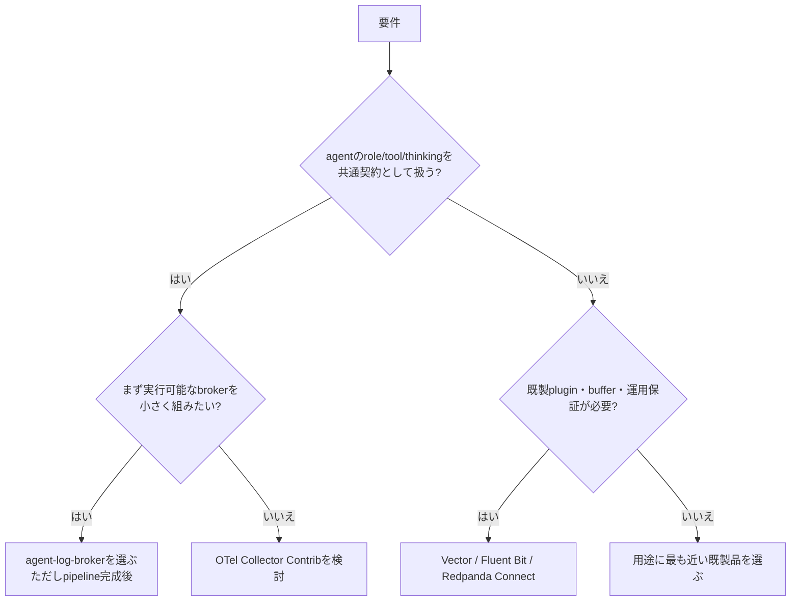

# 0. 要約

立ち位置: エージェントJSONLを読む・正規化する・秘匿化する・複数 consumer に配る TypeScript 部品で、現状は実行可能な製品ではない。

最大の弱点: Parse → Redact → Flag → Match → Deliver の接続と HTTP 配送が未実装で、永続 offset・trigger・DLQ もない。

次の一手: まず最小の end-to-end pipeline と配送の失敗保証を完成させ、既製品では表現しにくい「Claude/Codex セッション意味論＋consumer単位の秘匿化」を検証する。

# 1. このrepoは何か

一言でいえば、AskOS ワークスペースにおける agent session log の broker である。`~/.claude/projects/` の JSONL を監視し、将来は `AgentMessage` に変換して `BrokerEvent` に包み、full_stream / filtered / trigger の購読条件で AskOS、session-replay、Slack webhook、dashboard へ fan-out する設計だ。[README](../../README.md)

価値を出す単位は repo 単体の `FileWatcher` ではなく、agent のファイル出力を複数 consumer の webhook に変換する小さなパイプライン全体である。従って比較対象も、同じく source → transform/filter → delivery を担うログ・テレメトリパイプライン全体とした。利用者はこのエコシステムを組み立てる開発者・運用者であり、エージェント側の変更なしにログを再利用できることが狙いである。

実装上は `src/index.ts` が8つの公開 export を出す library だが、README自身が「各部品は存在するが running pipeline には未接続」と明記している。`BrokerCore.distribute()` は現状、consumerごとに常に成功を返す stub で、`SubscriptionManager.matches()` や redaction は呼ばない。`AgentMessage` へのJSONL変換、trigger評価、HTTP POST配送も未実装である。これは説明ではなく、[core.ts](../../src/broker/core.ts)、[subscription.ts](../../src/broker/subscription.ts)、[READMEの制限事項](../../README.md#known-limitations)を読んだ結果である。

到達点（2026-07-31、commit `3e349bf`）は TypeScript 8ファイル・924行、テスト52件、`npm test` 52 passed、`npm run build` / `npm run typecheck` 成功、runtime dependency 1件（`@unlaxer/tramli`）である。公開リリース運用・npm配布サイズ・自repoのGitHub star数は確認できなかった。package.json の license は `UNLICENSED` である。

# 1.5 調査の型

`library`。公開API・依存・テスト・実装状態をコードから確認できるため、単なる機能表ではなく、導入単位・拡張点・配送保証・実装の重さを比較する。比較対象は実装を公開しているOSSであり、各リポジトリの主要マニフェスト、構成、公式ドキュメント、公開コードページを確認した。ただし比較対象をこの環境でビルド・実行したわけではないので、外部製品のランタイム挙動については公式仕様以上に主張しない。

# 2. 比較対象と選定理由

| 製品 | 何ができるか | 採用状況（参照日） | ライセンス | うちとの決定的な違い | なぜ比較対象に選んだか |
|---|---|---|---|---|---|
| [Vector](https://github.com/vectordotdev/vector) | ファイル等から収集し、変換・ルーティングしてログ/メトリクスを送る agent/aggregator | ★21.9k / 最新リリース vdev-v0.3.3（2026-05-13） | MPL-2.0 | 既に end-to-end の実行エンジンで、at-least-once 等の運用機能まで持つ | source/transform/sink の構成が最も直接的に同じ |
| [Fluent Bit](https://github.com/fluent/fluent-bit) | Input / Filter / Output のプラグインで収集・解析・変換・配送。メモリ/ファイルbufferも持つ | ★7.9k / Fluent Bit 5.0.6（2026-05-21） | Apache-2.0 | C製の軽量常駐agentで、既製pluginとbuffer/backpressureが桁違い | ファイルtail＋複数宛先＋低負荷という代替候補 |
| [OpenTelemetry Collector Contrib](https://github.com/open-telemetry/opentelemetry-collector-contrib) | receiver / processor / exporter / connector を組み合わせてテレメトリを受け、処理、輸出 | ★4.7k / v0.153.0（2026-05-26） | Apache-2.0 | 標準化されたテレメトリ契約と巨大なcomponent catalogを持つ | agentログを標準イベントへ寄せる場合の標準解 |
| [Redpanda Connect](https://github.com/redpanda-data/connect) | YAMLで source → processor → sink を組み、変換・filter・fan-out・HTTP管理を行う | GitHub表示のstar数は今回確認できず / v4.94.0（2026-05-28） | coreはMIT、公開connectorはApache-2.0（製品ページ記載） | 宣言的設定と多数のconnectorで、brokerをコードで書かない | JSONイベントを複数先へ流す仕事を最短で置換できる |

この地図は寡占というより、成熟した汎用パイプラインが複数の実装思想で並ぶ市場である。Vector/Fluent Bitはログagent、OTelは標準化、Redpanda Connectは汎用データ連携に重心がある。いずれも「読む・変換する・送る」だけなら本repoより広く、採用状況も大きい。一方、Claude Codeのセッション構造、role/tool/thinkingの意味、consumerごとの redaction という agent 特有の契約は比較対象の汎用機能ではない。

# 4. 機能比較

凡例: ○=ある / △=部分的・要設定 / ×=ない。重み: ◎=この立ち位置で必須 / ○=効く / △=あれば良い / —=不要。

| 機能 | 重み | うち | Vector | Fluent Bit | OTel Contrib | Redpanda Connect |
|---|---|---:|---:|---:|---:|---:|
| ファイル/ストリーム入力 | ◎ | △（Claude JSONLのみ、未配線） | ○ | ○ | ○ | ○ |
| JSONL/agent固有の正規化 | ◎ | △（型のみ、変換未実装） | △（汎用parse） | ○（parser） | ○（receiver/processor） | ○（mapping） |
| consumerごとの条件ルーティング | ◎ | △（型とmatchesのみ、core未接続） | ○ | ○ | ○ | ○ |
| consumerごとの秘匿化 | ◎ | △（PII/credential実装、配送未接続） | ○（transformで構成） | ○（filterで構成） | ○（sensitive data filtering） | ○（processorで構成） |
| 複数宛先へのfan-out | ◎ | △（distribute stub） | ○ | ○ | ○ | ○ |
| HTTP配送 | ◎ | ×（stub） | ○ | ○ | ○ | ○ |
| 永続offset / 再起動後の再開 | ◎ | ×（in-memory） | ○ | ○ | △（構成依存） | △（at-least-once中心） |
| retry / backpressure / DLQ | ◎ | △（型とstubのみ） | ○ | ○ | ○ | ○ |
| trigger / throttle | ○ | ×（常にfalse） | △ | △ | ○（routing等で構成） | ○ |
| agent非依存の入力拡張 | ○ | △（将来adapter） | ○ | ○ | ○ | ○ |
| agentのrole/tool/thinkingを保つ契約 | ◎ | ○（BrokerEvent schema） | × | × | △ | × |
| 依存をAskOS ecosystemに合わせたconsumer lifecycle | ○ | ○（tramli） | × | × | × | × |

汎用運用機能の×/△が本repoの痛い差であり、とくにHTTP配送、永続offset、失敗時の再送は「将来機能」ではなくbrokerの成立条件である。逆に、role/tool/thinkingを契約として残すことと、consumer lifecycleをtramliで扱うことは、表の数では小さいが差別化になりうる。既製品にもredactionやroutingはあるので、単に「PIIを隠せる」「fan-outできる」だけでは差別化にならない。

## 4.5 コード・実装の比較

| 観点 | うち | Vector | Fluent Bit | OTel Contrib | Redpanda Connect | 出典 |
|---|---:|---:|---:|---:|---:|---|
| 実装言語 | TypeScript | Rust/CUE | C | Go | Go | 各公開repoの構成・マニフェスト |
| 自repoの公開export | 8 | 単一API数ではなくcomponent registry型 | plugin API型 | component builder型 | plugin/API型 | `src/index.ts` と各repoコード |
| 主要マニフェストの規模 | package.json 30行未満 | Cargo.toml 1,131 LOC | CMakeLists 1,502 LOC | go.mod 15 LOC（依存は別manifest） | go.mod 563 LOC | 公開コードページ、参照日 2026-07-31 |
| 自repoで確認したテスト | 52 passed / 4 files | 未実行 | 未実行 | 未実行 | 未実行 | `npm test -- --run` 実行結果 |
| runtime依存 | 1 | 大規模Cargo workspace | C/CMake依存 | 大規模Go component群 | 大規模Go module | 各manifest |
| 配布サイズ | npm公開サイズは不明 | 不明 | 不明 | 不明 | Linux x86_64 rpm 89.2 MB（v4.94.0） | Redpanda release assets |
| ライセンス | UNLICENSED | MPL-2.0 | Apache-2.0 | Apache-2.0 | core MIT / connector別 | package.json / LICENSE / 公式ページ |

この比較から、コード量の小ささは本repoの利点ではあるが、現時点では「小さく完成した」のでなく「小さく未完成」であると読める。Vector等は単一ライブラリAPIの数を競うものではなく、componentを設定で組む実行系なので、API数を単純比較するのは不適切だった。逆に、agent固有契約を薄いadapterとして実装し、配送保証を既製のruntimeへ委ねる設計なら、この小ささを活かせる。

# 5. 採用状況

| 製品 | GitHub star | 最新リリース | 継続性の読み取り |
|---|---:|---|---|
| Vector | 21.9k | 2026-05-13 | 13,000超のcommit、DatadogのOSSチームが保守と記載 |
| Fluent Bit | 7.9k | 2026-05-21 | CNCF graduated、major releaseを3–4か月周期と記載 |
| OTel Contrib | 4.7k | 2026-05-26 | CNCF/OTelのcomponent ecosystem、安定度をcomponent単位で表示 |
| Redpanda Connect | 不明 | 2026-05-28 | 数百contributor、300+ connectorと公式説明 |
| agent-log-broker | 不明 | 公開リリース不明 | HEADの最終commitは2026-07-10。公開採用状況は不明 |

starsは採用の証明ではないが、少なくとも本repoが汎用ログ基盤として市場認知を競う段階ではないことを示す。比較対象は継続的なリリース・保守組織・大規模componentを持つため、同じ土俵でplugin数や性能を追うのは不利である。採用を測るなら、まず ecosystem 内で何 consumer が実際に接続され、何件のイベントを損失なく運べたかを出すべきだ。

# 5.5 調査者の見立て

本当の勝負所は、ログ収集の速さではなく「agentの意味を失わずに、consumerごとに安全なイベントへ変換して届ける」契約だと読める。汎用agentはそこを知らないので、ここは本repoが勝てる可能性がある。

数字に出ていない懸念は、今の型が豊富な機能を宣言しているのに、実装の接続が追いついていないことだ。機能表の○を増やすより、実際に使える最小経路が無いことの方が採用を止める。

自分なら、Vector/Fluent Bitを競合として倒そうとはせず、agent-log-brokerを「agent固有adapter＋BrokerEvent契約＋安全なHTTP delivery」に絞り、汎用変換・buffer・監視は既製品へ渡す。

この見立てが外れるのは、AskOS ecosystem外でもClaude/Codexのログを扱いたい利用者が十分に現れ、汎用agentの設定ではagent固有契約を再現できないと実証できない場合である。その場合は差別化が狭すぎ、既製品のadapterで済む。

# 6. 提案（優先順）

| 順 | 提案 | 分類 | 根拠 | 最小の一手 | 効きそうな指標 |
|---:|---|---|---|---|---|
| 1 | Parse → redact → flag → match → deliver の最小pipelineを1本つなぐ | 埋める | 4節の◎が未実装。READMEにも未配線とある | Claude JSONL 1行を `BrokerEvent` にして、テストHTTP consumerへ送る | end-to-end成功率、1イベントの遅延 |
| 2 | 実HTTP配送、timeout、retry、per-consumer結果、DLQを実装する | 埋める | stub配送はbrokerの価値を成立させない | `fetch`配送＋指数backoff＋失敗イベントの永続保存を1consumerで実証 | 配送成功率、再送回数、DLQ件数 |
| 3 | offsetをファイルまたはSQLite等に永続化し、truncate/rotationを定義する | 埋める | 再起動でoffsetを失い、READMEにも制限として明記 | sessionPathとinode/サイズを含むoffset storeを追加 | 再起動後の重複/欠落数 |
| 4 | agent固有adapterと `BrokerEvent` schemaを公開契約として固める | 伸ばす | role/tool/thinkingとagent非依存adapterが唯一の差別化候補 | Claude adapterを完成し、Codex等は別adapterとして同じ契約に通す | consumer側のadapter不要率、schema破壊変更数 |
| 5 | `includeFields` / `excludeFields` / `redactionLevel` / triggerを実装する | 埋める | 型にあるが未適用。consumerごとの安全性が価値の中心 | まず field projection と standard/strict の統合テスト | 不要フィールド漏洩ゼロ、trigger精度 |
| 6 | 汎用plugin catalog、独自ストレージ、OTel全対応を目指さない | やらない | Vector/Fluent Bit/OTel/Redpanda Connectが既に強く、差別化を薄める | 連携用のHTTP/OTel出力だけを提供し、汎用機能は委譲する | 実装面積、保守対象plugin数 |

## 7. 選択の分岐

この分岐は、agent固有の意味を保持することと、汎用運用機能をすぐ使えることのトレードオフを表す。本repoは現時点では「選ぶべき」ではなく、最小pipelineと配送保証が完成した後に初めて選択肢になる。

# 8. 出典

| URL / ファイル | 参照日 | 何の根拠に使ったか |
|---|---|---|
| [repo README](../../README.md) | 2026-07-31 | 目的、ecosystem、責務、未実装の制限、roadmap |
| [package.json](../../package.json) | 2026-07-31 | package種別、依存、license、scripts |
| [src/index.ts](../../src/index.ts), [src/broker/core.ts](../../src/broker/core.ts), [src/broker/subscription.ts](../../src/broker/subscription.ts), [src/adapters/file-watcher.ts](../../src/adapters/file-watcher.ts), [src/security/redaction.ts](../../src/security/redaction.ts) | 2026-07-31 | 公開API、実装状態、offset、redaction、trigger、配送stub |
| [tests/](../../tests/) と `npm test -- --run` 実行結果 | 2026-07-31 | 52テスト成功 |
| [Vector GitHub](https://github.com/vectordotdev/vector) / [Cargo.toml](https://github.com/vectordotdev/vector/blob/master/Cargo.toml) | 2026-07-31 | star、最新リリース、ライセンス、Rust workspaceの実装規模 |
| [Vector file source](https://vector.dev/docs/reference/configuration/sources/file/) / [file sink](https://vector.dev/docs/reference/configuration/sinks/file/) | 2026-07-31 | file入力、source-transform-sink、delivery/acknowledgement |
| [Fluent Bit GitHub](https://github.com/fluent/fluent-bit) / [CMakeLists.txt](https://github.com/fluent/fluent-bit/blob/master/CMakeLists.txt) | 2026-07-31 | star、最新リリース、ライセンス、C実装規模 |
| [Fluent Bit manual](https://docs.fluentbit.io/manual) / [buffering](https://docs.fluentbit.io/manual/concepts/buffering) | 2026-07-31 | Input/Filter/Output、parser、buffer、backpressure |
| [OTel Collector Contrib GitHub](https://github.com/open-telemetry/opentelemetry-collector-contrib) / [go.mod](https://github.com/open-telemetry/opentelemetry-collector-contrib/blob/main/go.mod) | 2026-07-31 | star、最新リリース、ライセンス、Go moduleの構成 |
| [OTel Collector公式](https://opentelemetry.io/docs/collector/) / [receiver一覧](https://opentelemetry.io/docs/collector/components/receiver/) | 2026-07-31 | receiver/processor/exporter/connector、retry・filtering用途、component catalog |
| [Redpanda Connect GitHub](https://github.com/redpanda-data/connect) / [go.mod](https://github.com/redpanda-data/connect/blob/main/go.mod) / [release v4.94.0](https://github.com/redpanda-data/connect/releases/tag/v4.94.0) | 2026-07-31 | star表示の有無、最新リリース、Go module規模 |
| [Redpanda Connect公式](https://docs.redpanda.com/connect/configuration/dynamic_inputs_and_outputs/) / [dynamic output](https://docs.redpanda.com/connect/components/outputs/dynamic/) / [製品ページ](https://www.redpanda.com/connect) | 2026-07-31 | 動的fan-out、HTTP API、connector数、ライセンス区分、配布サイズ |
