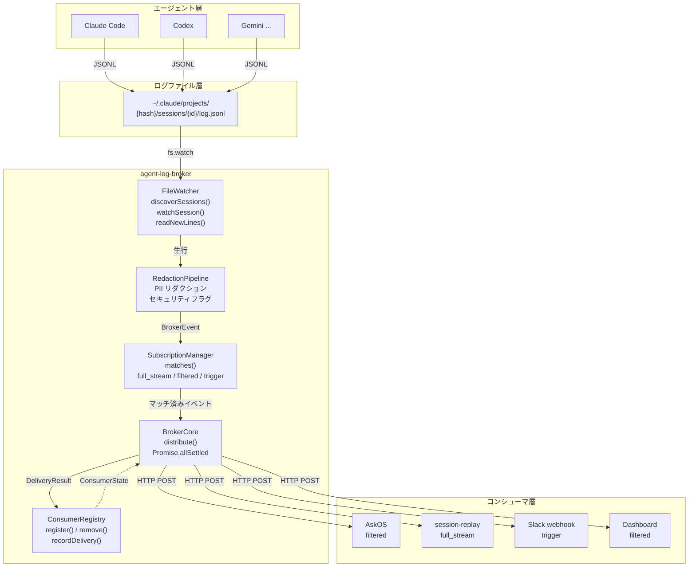
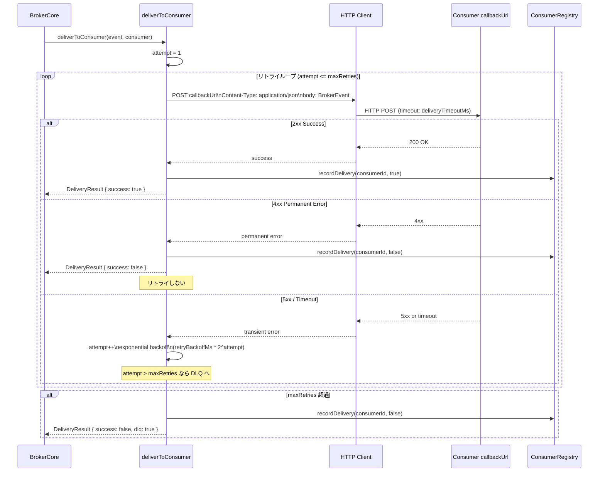
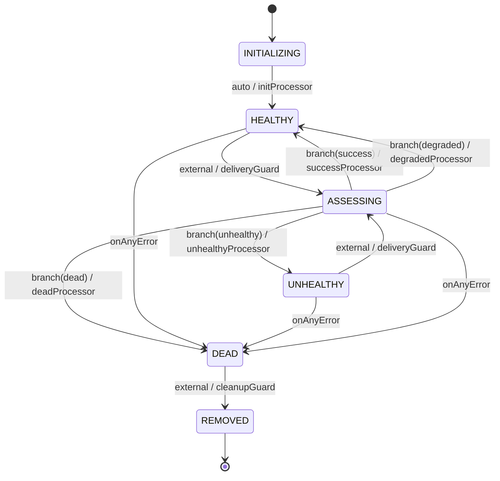
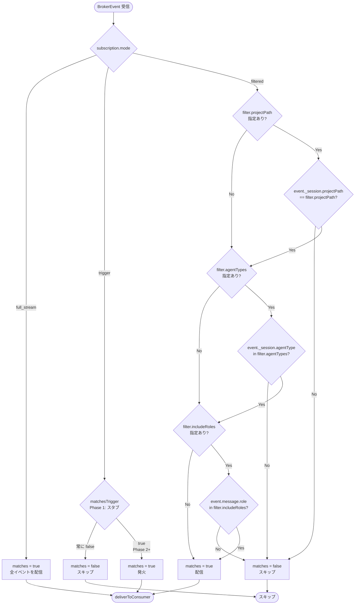

# agent-log-broker — Technical Specification

**Version**: 1.0  
**Status**: Living document (Phase 1 baseline)  
**Date**: 2026-04-19  
**Repository**: opaopa6969/agent-log-broker  
**Package**: `@unlaxer/agent-log-broker`

---

## Table of Contents

1. [概要 — Overview](#1-概要--overview)
2. [機能仕様 — Functional Specification](#2-機能仕様--functional-specification)
3. [データ永続化層 — Data Persistence Layer](#3-データ永続化層--data-persistence-layer)
4. [ステートマシン — State Machine](#4-ステートマシン--state-machine)
5. [ビジネスロジック — Business Logic](#5-ビジネスロジック--business-logic)
6. [API/外部境界 — API and External Boundaries](#6-api外部境界--api-and-external-boundaries)
7. [UI](#7-ui)
8. [設定 — Configuration](#8-設定--configuration)
9. [依存 — Dependencies](#9-依存--dependencies)
10. [非機能要件 — Non-Functional Requirements](#10-非機能要件--non-functional-requirements)
11. [テスト戦略 — Test Strategy](#11-テスト戦略--test-strategy)
12. [デプロイ/運用 — Deployment and Operations](#12-デプロイ運用--deployment-and-operations)

---

## 1. 概要 — Overview

### 1.1 システムの目的

agent-log-broker は AskOS ワークスペースエコシステムにおける **Claude セッションログのセントラルブローカー** である。  
JSONL 形式で書き込まれたエージェントログファイルを監視し、登録済みコンシューマへファンアウト配信する。

設計原則: **"I am a pipe, not a judge."**  
ブローカーはログの内容を解釈・判断しない。受信し、必要に応じて PII をリダクションし、配信する。それのみが責務である。

### 1.2 システムのスコープ

agent-log-broker が行うこと (7つの責務):

| 番号 | 責務 | 担当モジュール |
|------|------|--------------|
| 1 | ログファイルのディスカバリ | `FileWatcher.discoverSessions()` |
| 2 | ファイル変更の監視 | `FileWatcher.watchSession()` |
| 3 | JSONL 行のパース | アダプター層 |
| 4 | PII リダクション | `RedactionPipeline` |
| 5 | 危険コンテンツのフラグ付け | `RedactionPipeline` |
| 6 | コンシューマへのファンアウト配信 | `BrokerCore.distribute()` |
| 7 | 読み取りオフセットの追跡 | `FileWatcher` (インメモリ) |

agent-log-broker が行わないこと:

- ログの永続化 (コンシューマの責務)
- エージェントの制御 (AskOS の責務)
- UI レンダリング (session-replay の責務)
- 内容に基づく判断 (コンシューマの責務)

### 1.3 エコシステムにおける位置づけ

```
エージェント (Claude Code, Codex, Gemini, ...)
  │
  │  JSONL ログファイル出力
  ▼
┌──────────────────────────────────────┐
│         agent-log-broker             │
│                                      │
│  Discover → Watch → Parse            │
│  → Redact → Flag                     │
│  → Distribute                        │
└───────────────┬──────────────────────┘
                │ fan-out (HTTP POST)
                ├──→ AskOS            (filtered: 進捗 + 異常のみ)
                ├──→ session-replay   (full_stream: 全メッセージ)
                ├──→ Slack webhook    (trigger: セキュリティアラートのみ)
                └──→ Dashboard        (filtered: メタデータのみ)
```



### 1.4 エージェント非依存原則 (BRK-AGENT-AGNOSTIC)

ブローカーはエージェント側への変更を一切必要としない。ログファイルを外部から読み取るだけである。  
新しいエージェントへの対応は、アダプターを1つ追加するだけで実現できる。既存コードへの変更は不要。

### 1.5 フェーズ概要

| フェーズ | スコープ | 状態 |
|---------|---------|------|
| Phase 1 | FileWatcher + 基本ファンアウト + ConsumerRegistry + RedactionPipeline | 実装中 (現行) |
| Phase 2 | trigger 評価 + DLQ + Persistent オフセット | 計画中 |
| Phase 3 | OIDC 認証 + Management API + Catch-up | 計画中 |

---

## 2. 機能仕様 — Functional Specification

### 2.1 FileWatcher

**ファイル**: `src/adapters/file-watcher.ts`

#### 2.1.1 概要

`~/.claude/projects/` 以下の JSONL ログファイルを監視するアダプター。  
Node.js 標準の `fs.watch` API を使用する。エージェント側の変更を一切必要としない (BRK-AGENT-AGNOSTIC)。

#### 2.1.2 ディスカバリ

`discoverSessions(): Promise<DiscoveredSession[]>`

- `basePath` (デフォルト: `~/.claude/projects`) を走査する
- ディレクトリ構造: `{basePath}/{projectHash}/sessions/{sessionId}/log.jsonl`
- `log.jsonl` が存在するセッションを `DiscoveredSession` として返す
- ファイルが存在しない場合、アクセス権エラーはサイレントにスキップする

```typescript
interface DiscoveredSession {
  sessionId: string;
  sessionPath: string;  // log.jsonl の絶対パス
  projectPath: string;  // ハッシュ (将来的にはシンボリックリンク解決)
  agentType: string;    // "claude" (固定, Phase 1)
}
```

#### 2.1.3 セッション監視

`watchSession(sessionPath: string, onLine: (line: string, offset: number) => void): void`

- `fs.watch` で指定パスの変更を検知する
- 変更検知時に `readNewLines()` を呼び出す
- 既に監視中のパスは再登録しない (べき等)
- オフセットはインメモリで管理する (`Map<string, number>`)

`readNewLines(sessionPath, onLine)` の動作:

1. ファイル全体を UTF-8 で読み込む
2. `currentOffset` 以降の新規コンテンツをスライスする
3. 改行で分割し、空行をフィルタリングする
4. 各行に対して `onLine(line, offset)` を呼び出す
5. バイトオフセットを更新する (`Buffer.byteLength(line, "utf-8") + 1`)

#### 2.1.4 監視停止

| メソッド | 動作 |
|---------|------|
| `unwatchSession(sessionPath)` | 指定パスの watcher を停止し、Map から削除 |
| `close()` | 全 watcher を停止 |

#### 2.1.5 オフセット管理

- オフセットは `Map<string, number>` でインメモリ管理する
- プロセス再起動時にオフセットは消失する
- 再起動後は全セッションをオフセット 0 から再読み込みする
- 永続オフセットストアは Phase 2 の課題である

#### 2.1.6 オプション

```typescript
interface FileWatcherOptions {
  basePath?: string;          // デフォルト: ~/.claude/projects
  scanIntervalSeconds?: number; // デフォルト: 30
}
```

### 2.2 サブスクリプション管理

**ファイル**: `src/broker/subscription.ts`

#### 2.2.1 SubscriptionManager

コンシューマのサブスクリプション定義を管理するクラス。

| メソッド | 説明 |
|---------|------|
| `add(subscription)` | サブスクリプションを登録 |
| `remove(consumerId)` | サブスクリプションを削除 |
| `get(consumerId)` | サブスクリプションを取得 |
| `list()` | 全サブスクリプションをリストアップ |
| `matches(event, subscription)` | イベントがサブスクリプションにマッチするか評価 |

#### 2.2.2 サブスクリプションモード

サブスクリプションには3つのモードがある:

**full_stream**

- 全セッションの全イベントを受信する
- フィルタリングなし
- session-replay が使用する

**filtered**

- フィルター条件にマッチするイベントのみ受信する
- フィルター評価は `matchesFilter()` が行う
- AskOS が使用する

**trigger**

- 特定条件にマッチした場合のみ発火する
- Phase 1 では `matchesTrigger()` は常に `false` を返すスタブである
- Slack webhook が使用する予定

#### 2.2.3 フィルター評価ロジック

`matchesFilter(event, filter)` の評価順序:

1. `filter.projectPath` が指定されている場合: `event._session.projectPath` と一致しなければ除外
2. `filter.agentTypes` が指定されている場合: `event._session.agentType` が含まれなければ除外
3. `filter.includeRoles` が指定されている場合: `event.message.role` が含まれなければ除外
4. 上記を通過した場合は配信対象

#### 2.2.4 Subscription データ型

```typescript
interface Subscription {
  consumerId: string;
  callbackUrl: string;
  mode: SubscriptionMode;      // "full_stream" | "filtered" | "trigger"
  filter?: FilterConfig;
  trigger?: TriggerConfig;
  catchUp?: CatchUpConfig;
  createdAt: string;           // ISO 8601
}
```

### 2.3 配信エンジン (BrokerCore)

**ファイル**: `src/broker/core.ts`

#### 2.3.1 概要

ファンアウトエンジン。ステートレス — 設定のみを保持する。

#### 2.3.2 distribute

`distribute(event, consumers): Promise<Map<string, DeliveryResult>>`

- 全コンシューマへ並行して配信する
- `Promise.allSettled` を使用するため、1件の失敗が他の配信をブロックしない
- 各コンシューマの配信結果を `Map<consumerId, DeliveryResult>` で返す

#### 2.3.3 deliverToConsumer

`private deliverToConsumer(event, consumer): Promise<DeliveryResult>`

**現在の実装 (Phase 1)**: HTTP POST スタブ。常に `{ success: true }` を返す。  
**Phase 1 実装予定**: 実際の HTTP POST 配信。タイムアウト・リトライ付き。



レスポンスコード処理 (Phase 1 実装時):

| レスポンス | 処理 |
|-----------|------|
| 2xx | 配信成功 → `recordDelivery(id, true)` |
| 4xx | 永続エラー → リトライなし (コンシューマ側の問題) |
| 5xx | 一時エラー → リトライ → DLQ |
| タイムアウト | 一時エラー扱い |

#### 2.3.4 BrokerCoreOptions

```typescript
interface BrokerCoreOptions {
  maxRetries: number;        // デフォルト: 3
  retryBackoffMs: number;    // デフォルト: 1000 (指数バックオフのベース)
  deliveryTimeoutMs: number; // デフォルト: 5000
}
```

---

## 3. データ永続化層 — Data Persistence Layer

### 3.1 オフセット管理 (インメモリ)

#### 3.1.1 現在の実装

FileWatcher は `Map<string, number>` でバイトオフセットをインメモリ管理する。

```
Map {
  "/home/opa/.claude/projects/abc123/sessions/xyz/log.jsonl" => 4096,
  "/home/opa/.claude/projects/def456/sessions/uvw/log.jsonl" => 8192,
}
```

- キー: セッションログファイルの絶対パス
- 値: 最後に読み取ったバイトオフセット
- 初期値: 0
- 更新タイミング: 新規行読み取りごと (`readNewLines` 内)

#### 3.1.2 制約と影響

| 制約 | 影響 |
|------|------|
| プロセス再起動でオフセット消失 | 再起動後は全セッションを先頭から再読み込み |
| 同一行が重複して配信される可能性 | コンシューマ側で `_broker.messageId` による冪等性処理が必要 |

#### 3.1.3 Phase 2: 永続オフセットストア

Phase 2 では SQLite または JSON ファイルベースの永続オフセットストアを実装する。  
`FileWatcher` のインターフェースは変更しない — オフセットストアは差し替え可能な依存として注入する。

### 3.2 コンシューマライフサイクル状態 (インメモリ)

#### 3.2.1 現在の実装

ConsumerRegistry は `InMemoryFlowStore` (tramli が提供) を使用する。

- コンシューマごとに 1 つの `FlowInstance<ConsumerState>` を持つ
- `FlowInstance` は以下の `FlowContext` キーを保持する:

| flowKey | 型 | 説明 |
|---------|-----|------|
| `deliverySuccess` | `boolean` | 最後の配信試行の成否 (外部から注入) |
| `errorCount` | `number` | 連続エラー数 |
| `messagesDelivered` | `number` | 累計配信成功数 |
| `lastDelivery` | `string \| null` | 最後の成功配信の ISO 8601 タイムスタンプ |

#### 3.2.2 制約

- プロセス再起動で全コンシューマの状態が消失する
- `DEAD` コンシューマも再起動後は `HEALTHY` から再開する
- Phase 2 で DB バックの `FlowStore` に移行予定

### 3.3 BrokerEvent スキーマ (JSON Schema Draft 2020-12)

**ファイル**: `schemas/broker-event.schema.json`  
**$id**: `https://askos.dev/schemas/broker-event.schema.json`

#### 3.3.1 概要

BrokerEvent はブローカーとコンシューマ間の契約である。  
TypeScript インターフェースに加え、言語非依存の JSON Schema (Draft 2020-12) を提供する。

Draft 2020-12 を採用する理由:
- 言語非依存の契約 (Python, Go 等のクライアントが型生成可能)
- AskOS ワークスペースのスキーマ標準と統一
- `$dynamicRef` 等の将来的な構造化への対応

#### 3.3.2 スキーマ構造

```json
{
  "$schema": "https://json-schema.org/draft/2020-12/schema",
  "$id": "https://askos.dev/schemas/broker-event.schema.json",
  "title": "BrokerEvent",
  "type": "object",
  "required": ["_broker", "_session", "type"],
  "properties": {
    "_broker": { ... },    // ブローカーエンベロープ
    "_session": { ... },   // セッションメタデータ
    "_index": { ... },     // インデックス情報 (オプション)
    "type": { ... },       // イベントタイプ
    "message": { ... },    // エージェントメッセージ (オプション)
    "securityFlags": [...], // セキュリティフラグ配列
    "bannedWordHits": [...]  // 禁止ワードヒット配列
  }
}
```

#### 3.3.3 各フィールドの詳細

**_broker (required)**

```typescript
interface BrokerEnvelope {
  version: string;         // "1.0" (const)
  messageId: string;       // UUID, 冪等性キー
  deliveredAt: string;     // ISO 8601 date-time
  deliveryAttempt: number; // minimum: 1
}
```

**_session (required)**

```typescript
interface SessionMeta {
  sessionId: string;
  sessionPath: string;  // log.jsonl の絶対パス
  projectPath: string;  // プロジェクトハッシュ
  agentType: string;    // "claude" | 将来的に他エージェント
}
```

**_index (optional)**

```typescript
interface IndexMeta {
  messageIndex: number; // セッション内での行インデックス (minimum: 0)
  byteOffset: number;   // ファイル内のバイトオフセット (minimum: 0)
}
```

**type (required)**

```typescript
type BrokerEventType =
  | "message"           // エージェントメッセージ
  | "session.discovered" // 新規セッション発見
  | "session.idle"      // セッションがアイドル状態
  | "session.lost";     // セッションファイルが消失
```

**message (optional)**

```typescript
interface AgentMessage {
  role: "user" | "assistant" | "system";
  text?: string;
  toolUses?: unknown[];
  toolResults?: unknown[];
  thinking?: string[];
  timestamp: string; // ISO 8601 date-time
}
```

**securityFlags (optional array)**

```typescript
interface SecurityFlag {
  type: string;
  severity: "low" | "medium" | "high" | "critical";
  detail: string;
  field: string;
}
```

#### 3.3.4 スキーマバージョン管理

- `_broker.version` フィールドは `"1.0"` の const として宣言されている
- 破壊的変更を行う場合はバージョンを `"2.0"` 等に更新する
- コンシューマはバージョンフィールドで互換性チェックが可能

---

## 4. ステートマシン — State Machine

### 4.1 概要

各コンシューマのライフサイクルは tramli (`@unlaxer/tramli`) で実装されたステートマシンで管理する。  
アドホックな状態フラグではなく、明示的・検証可能なステートマシンを採用する。

**ファイル**: `src/consumers/lifecycle.ts`

### 4.2 状態定義

```typescript
type ConsumerState =
  | "INITIALIZING"  // 登録直後
  | "HEALTHY"       // 正常稼働中
  | "ASSESSING"     // 分岐評価中 (一時状態)
  | "UNHEALTHY"     // エラー率超過
  | "DEAD"          // 最大リトライ到達
  | "REMOVED";      // 削除完了 (終端)
```

| 状態 | 意味 | 終端 | 配信試行 |
|------|------|------|---------|
| `INITIALIZING` | 登録直後、自動遷移待ち | no | no |
| `HEALTHY` | 正常稼働中 | no | yes |
| `ASSESSING` | 分岐評価中 (一時状態) | no | no |
| `UNHEALTHY` | エラー閾値超過、配信継続 | no | yes |
| `DEAD` | 最大リトライ到達、配信停止 | no | no |
| `REMOVED` | クリーンアップ完了 | **yes** | no |

### 4.3 遷移図

```
INITIALIZING ──auto──────────────────────────────────────────> HEALTHY
                                                                    │
HEALTHY      ──external(recordDelivery)──> ASSESSING ──────────────┤
                                               branch               │
UNHEALTHY    ──external(recordDelivery)──> ASSESSING ──────────────┤
                                                           ┌────────┴────────┐
                                                           ▼                 ▼
                                                       HEALTHY           UNHEALTHY
                                                                              │
                                                         DEAD ◄──────────────┘
                                                          ▲
                                                          │ onAnyError (任意の状態から)
                                                          │
                                                       REMOVED (終端)
                                             DEAD ──external(remove)──> REMOVED
```

Mermaid 形式:



### 4.4 遷移詳細

#### INITIALIZING → HEALTHY (auto)

`startFlow()` 呼び出し後に即座に発火する。外部入力は不要。

**プロセッサ**: `initProcessor`
- `produces`: `errorCount = 0`, `messagesDelivered = 0`, `lastDelivery = null`

#### HEALTHY / UNHEALTHY → ASSESSING (external)

`ConsumerRegistry.recordDelivery(id, success)` 呼び出し時に発火する。

**ガード**: `deliveryGuard`
- `requires`: `deliverySuccess` (`externallyProvided` で宣言)
- 常に `accepted` を返す

#### ASSESSING → branch (4方向)

`assessBranch.decide(ctx)` が `deliverySuccess` と `errorCount` を読み取り分岐を決定する。

```typescript
decide(ctx) {
  const success = ctx.get(DELIVERY_SUCCESS);
  if (success) return "success";
  const nextErrors = ctx.get(ERROR_COUNT) + 1;
  if (nextErrors >= maxRetries) return "dead";
  if (nextErrors >= errorThreshold) return "unhealthy";
  return "degraded"; // 閾値未満 — HEALTHY に戻るがエラーを記録
}
```

| 分岐ラベル | 遷移先 | プロセッサ |
|-----------|--------|----------|
| `"success"` | `HEALTHY` | `successProcessor` — `errorCount = 0`, `messagesDelivered++`, `lastDelivery = now` |
| `"degraded"` | `HEALTHY` | `degradedProcessor` — `errorCount++` のみ |
| `"unhealthy"` | `UNHEALTHY` | `unhealthyProcessor` — `errorCount++` |
| `"dead"` | `DEAD` | `deadProcessor` — `errorCount++` |

#### DEAD → REMOVED (external)

`ConsumerRegistry.remove(id)` 呼び出し時に発火する。`DEAD` 状態のみで有効。

**ガード**: `cleanupGuard` — 常に `accepted`

#### any → DEAD (onAnyError)

任意のプロセッサまたはガードが未処理例外をスローした場合、現在の状態に関わらず `DEAD` へ遷移する。  
tramli の `.onAnyError("DEAD")` ディレクティブにより宣言される。

### 4.5 FlowContext キー

```typescript
const DELIVERY_SUCCESS = flowKey<boolean>("deliverySuccess");    // 外部注入
const ERROR_COUNT      = flowKey<number>("errorCount");          // プロセッサが管理
const MESSAGES_DELIVERED = flowKey<number>("messagesDelivered"); // プロセッサが管理
const LAST_DELIVERY    = flowKey<string | null>("lastDelivery"); // プロセッサが管理
```

### 4.6 tramli 採用理由

| 理由 | 詳細 |
|------|------|
| ビルド時正確性 | `build()` がステート定義・`requires/produces` 契約を検証 |
| データフロー宣言 | `assessBranch` の依存関係 (`DELIVERY_SUCCESS`, `ERROR_COUNT`) がコードで明示 |
| 外部入力の明示 | `externallyProvided(DELIVERY_SUCCESS)` で呼び出し元との契約を宣言 |
| ワークスペース統一 | AskOS ワークスペース全体で tramli を採用 |
| LLM フレンドリー | `lifecycle.ts` (165行) で完結する読みやすい宣言 |

---

## 5. ビジネスロジック — Business Logic

### 5.1 サブスクリプションモードとフィルタリング



#### 5.1.1 full_stream モード

```
matches() → 常に true
```

全セッションの全イベントを無条件で配信する。セッション発見イベント (`session.discovered`)、アイドルイベント (`session.idle`)、ロストイベント (`session.lost`) を含む。

#### 5.1.2 filtered モード

`FilterConfig` の条件を順番に評価する:

1. `projectPath` — セッションのプロジェクトパスが一致しなければ除外
2. `agentTypes` — セッションのエージェントタイプが含まれなければ除外
3. `includeRoles` — メッセージのロールが含まれなければ除外
4. 全条件を通過したイベントを配信

フィールド射影 (`includeFields`, `excludeFields`) および最小配信間隔 (`minIntervalMs`) は Phase 2 の実装予定。

**FilterConfig の全フィールド**:

```typescript
interface FilterConfig {
  projectPath?: string;       // 特定プロジェクトのみ
  agentTypes?: string[];      // 対象エージェントタイプ
  includeRoles?: string[];    // 対象ロール: "user" | "assistant"
  includeFields?: string[];   // ペイロードに含めるフィールド
  excludeFields?: string[];   // ペイロードから除外するフィールド
  minIntervalMs?: number;     // 最小配信間隔 (ms)
  redactionLevel?: RedactionLevel; // "minimal" | "standard" | "strict"
}
```

#### 5.1.3 trigger モード

`TriggerConfig` の条件を評価し、マッチした場合のみ発火する。  
**Phase 1 では `matchesTrigger()` は常に `false` を返すスタブ**。

**TriggerConfig の構造**:

```typescript
interface TriggerConfig {
  conditions: TriggerCondition[];
  conditionLogic?: "and" | "or";   // デフォルト: "and"
  throttleSeconds?: number;         // 発火スロットリング
  cooldownPerSession?: boolean;     // セッションごとのクールダウン
  format?: "json" | "slack";       // 出力フォーマット
  template?: Record<string, unknown>; // テンプレート
}

interface TriggerCondition {
  field: string;
  op: "not_empty" | "exists_where" | "in" | "equals";
  subField?: string;
  value?: unknown;
}
```

典型的なユースケース: `securityFlags` が空でない場合に Slack へ通知する。

### 5.2 BrokerEvent 構築

#### 5.2.1 イベント生成フロー

```
JSONL 生行 (文字列)
    │
    ▼ JSON.parse()
生ログオブジェクト
    │
    ▼ アダプター変換 (AgentMessage への正規化)
AgentMessage
    │
    ▼ RedactionPipeline.process()
リダクション済みテキスト + SecurityFlag[]
    │
    ▼ BrokerEvent 構築
{
  _broker: { version, messageId: uuid(), deliveredAt: now, deliveryAttempt: 1 },
  _session: { sessionId, sessionPath, projectPath, agentType },
  _index: { messageIndex, byteOffset },
  type: "message",
  message: { role, text: redactedText, toolUses, ... },
  securityFlags: [...],
}
```

#### 5.2.2 イベントタイプ

| type | 発生条件 |
|------|---------|
| `"message"` | 新規 JSONL 行を検出 |
| `"session.discovered"` | 新規セッションディレクトリを発見 |
| `"session.idle"` | セッションファイルへの書き込みが一定期間ない |
| `"session.lost"` | セッションファイルが削除・移動された |

### 5.3 リダクションパイプライン

**ファイル**: `src/security/redaction.ts`

#### 5.3.1 リダクションレベル

| レベル | 適用パターン |
|--------|------------|
| `"minimal"` | PII パターンのみ (メール, 電話, SSN) |
| `"standard"` | PII + 認証情報・シークレット |
| `"strict"` | PII + 認証情報 + ファイルパス (Phase 2 実装予定) |

デフォルトレベル: `"standard"`

#### 5.3.2 PII パターン

| パターン名 | 正規表現 | リダクション後 |
|-----------|---------|-------------|
| email | `[a-zA-Z0-9._%+-]+@[a-zA-Z0-9.-]+\.[a-zA-Z]{2,}` | `[REDACTED:EMAIL]` |
| phone (US) | `\b\d{3}[-.]?\d{3}[-.]?\d{4}\b` | `[REDACTED:PHONE]` |
| SSN | `\b\d{3}-\d{2}-\d{4}\b` | `[REDACTED:SSN]` |
| phone (JP) | `\b0\d{1,4}-\d{1,4}-\d{4}\b` | `[REDACTED:PHONE]` |

#### 5.3.3 クレデンシャルパターン (standard 以上)

| パターン名 | 正規表現 | リダクション後 |
|-----------|---------|-------------|
| aws_key | `AKIA[0-9A-Z]{16}` | `[REDACTED:AWS_KEY]` |
| generic_secret | `(?:password\|secret\|token\|api_key\|apikey)\s*[:=]\s*['"]?[^\s'"]{8,}` | `[REDACTED:SECRET]` |

#### 5.3.4 危険コマンドフラグ (全レベル、リダクションなし)

検出するパターン:

```
"rm -rf", "chmod 777", "curl | bash", "wget | sh",
".env", "id_rsa", "/etc/shadow", "/etc/passwd"
```

フラグ生成例:
```typescript
{
  type: "dangerous_command",
  severity: "critical", // "rm -rf" の場合
  detail: "Dangerous pattern detected: rm -rf",
  field: "text",
}
```

#### 5.3.5 RedactionResult

```typescript
interface RedactionResult {
  redactedText: string;
  redactionCount: number;
  securityFlags: SecurityFlag[];
}
```

---

## 6. API/外部境界 — API and External Boundaries

### 6.1 HTTP API

**Phase 1 ステータス**: HTTP API サーバーは未実装。Express/Fastify サーバー層は Phase 1 の課題。

**計画中エンドポイント** (Phase 1 実装予定):

| メソッド | パス | 説明 |
|---------|------|------|
| `POST` | `/api/subscribe` | コンシューマ登録 |
| `DELETE` | `/api/subscribe/:consumerId` | コンシューマ登録解除 |
| `GET` | `/api/consumers` | 全コンシューマ一覧 |
| `GET` | `/api/consumers/:consumerId` | コンシューマ詳細・状態 |
| `GET` | `/api/status` | ブローカー状態 (Phase 3) |
| `POST` | `/api/watch` | セッション監視開始 (Phase 3) |
| `GET` | `/api/sessions` | 監視中セッション一覧 (Phase 3) |

デフォルトポート: `3100`

#### 6.1.1 POST /api/subscribe — コンシューマ登録リクエスト

```json
{
  "consumerId": "session-replay",
  "callbackUrl": "http://localhost:4200/broker/events",
  "mode": "full_stream"
}
```

```json
{
  "consumerId": "askos",
  "callbackUrl": "http://localhost:3000/broker/events",
  "mode": "filtered",
  "filter": {
    "projectPath": "/home/opa/work/my-project",
    "includeRoles": ["assistant"],
    "includeFields": ["toolUses", "text", "securityFlags"],
    "excludeFields": ["toolResults", "thinking"],
    "redactionLevel": "standard"
  }
}
```

```json
{
  "consumerId": "slack-security",
  "callbackUrl": "https://hooks.slack.com/services/...",
  "mode": "trigger",
  "trigger": {
    "conditions": [
      { "field": "securityFlags", "op": "not_empty" }
    ],
    "throttleSeconds": 300
  }
}
```

### 6.2 コンシューマ コールバックインターフェース

コンシューマは `callbackUrl` で `POST` リクエストを受け付ける必要がある。

#### 6.2.1 リクエスト仕様

- **メソッド**: `POST`
- **Content-Type**: `application/json`
- **ボディ**: `BrokerEvent` オブジェクト (JSON Schema: `schemas/broker-event.schema.json`)
- **タイムアウト**: 5秒 (設定可能)

#### 6.2.2 レスポンス規約

| レスポンスコード | ブローカーの動作 |
|---------------|---------------|
| `2xx` | 配信成功 → `ConsumerRegistry.recordDelivery(id, true)` |
| `4xx` | 永続エラー → リトライなし、スキップ |
| `5xx` | 一時エラー → 指数バックオフでリトライ → DLQ |
| タイムアウト | 一時エラー扱い |

#### 6.2.3 BrokerEvent サンプル

```json
{
  "_broker": {
    "version": "1.0",
    "messageId": "f47ac10b-58cc-4372-a567-0e02b2c3d479",
    "deliveredAt": "2026-04-19T10:00:00.000Z",
    "deliveryAttempt": 1
  },
  "_session": {
    "sessionId": "abc123def456",
    "sessionPath": "/home/opa/.claude/projects/-home-opa-work-my-project/sessions/abc123def456/log.jsonl",
    "projectPath": "-home-opa-work-my-project",
    "agentType": "claude"
  },
  "_index": {
    "messageIndex": 42,
    "byteOffset": 16384
  },
  "type": "message",
  "message": {
    "role": "assistant",
    "text": "I will create the configuration file now.",
    "toolUses": [],
    "toolResults": [],
    "thinking": [],
    "timestamp": "2026-04-19T09:59:58.123Z"
  },
  "securityFlags": [],
  "bannedWordHits": []
}
```

### 6.3 現在の API 代替手段

HTTP API が実装されるまでは、`ConsumerRegistry` をプログラム的に使用する:

```typescript
import { ConsumerRegistry, FileWatcher, BrokerCore, SubscriptionManager } from "@unlaxer/agent-log-broker";

const registry = new ConsumerRegistry({ errorThreshold: 3, maxRetries: 10 });
const consumer = await registry.register("my-consumer", "http://localhost:9000/events");

const subscriptionManager = new SubscriptionManager();
subscriptionManager.add({
  consumerId: "my-consumer",
  callbackUrl: "http://localhost:9000/events",
  mode: "full_stream",
  createdAt: new Date().toISOString(),
});
```

### 6.4 catch-up (過去ログ再生)

Phase 3 で実装予定。登録時に `catchUp` パラメーターを指定することで過去ログを再生できる。

```typescript
interface CatchUpConfig {
  since?: string;                 // ISO 8601 — この日時以降のメッセージ
  sessions?: "all" | string[];    // 対象セッション
}
```

---

## 7. UI

agent-log-broker 自体は UI を持たない。

UI はコンシューマの責務である:

- **session-replay** (`claude-session-replay`): セッションログの蓄積・再生・表示
- **Dashboard** コンシューマ: filtered モードでメタデータを受信し表示

ブローカーが将来的に提供する可能性があるもの:

- `/api/status` エンドポイント (Phase 3) — 運用監視ツールとの統合
- ヘルスチェックエンドポイント (Phase 2)

---

## 8. 設定 — Configuration

### 8.1 コンシューマスペック

コンシューマは登録時に以下のスペックを指定する:

#### 8.1.1 共通フィールド

```typescript
interface Subscription {
  consumerId: string;         // ユニークID (必須)
  callbackUrl: string;        // HTTP コールバック URL (必須)
  mode: SubscriptionMode;     // "full_stream" | "filtered" | "trigger" (必須)
  filter?: FilterConfig;      // filtered モード時のフィルター設定
  trigger?: TriggerConfig;    // trigger モード時のトリガー設定
  catchUp?: CatchUpConfig;    // 過去ログ再生設定 (Phase 3)
  createdAt: string;          // ISO 8601 (自動設定)
}
```

#### 8.1.2 FilterConfig

```typescript
interface FilterConfig {
  projectPath?: string;          // 対象プロジェクトパス
  agentTypes?: string[];         // 対象エージェントタイプ
  includeRoles?: string[];       // 対象ロール
  includeFields?: string[];      // 含めるフィールド
  excludeFields?: string[];      // 除外するフィールド
  minIntervalMs?: number;        // 最小配信間隔 (ms)
  redactionLevel?: RedactionLevel; // "minimal" | "standard" | "strict"
}
```

#### 8.1.3 TriggerConfig

```typescript
interface TriggerConfig {
  conditions: TriggerCondition[]; // 評価条件 (1つ以上)
  conditionLogic?: "and" | "or";  // 条件結合ロジック (デフォルト: "and")
  throttleSeconds?: number;        // スロットリング秒数
  cooldownPerSession?: boolean;    // セッションごとのクールダウン
  format?: "json" | "slack";      // 出力フォーマット
  template?: Record<string, unknown>; // テンプレート
}
```

### 8.2 ブローカー設定

#### 8.2.1 BrokerCoreOptions

```typescript
interface BrokerCoreOptions {
  maxRetries: number;        // デフォルト: 3
  retryBackoffMs: number;    // デフォルト: 1000
  deliveryTimeoutMs: number; // デフォルト: 5000
}
```

#### 8.2.2 FileWatcherOptions

```typescript
interface FileWatcherOptions {
  basePath?: string;            // デフォルト: ~/.claude/projects
  scanIntervalSeconds?: number; // デフォルト: 30
}
```

#### 8.2.3 LifecycleConfig

```typescript
interface LifecycleConfig {
  errorThreshold: number;  // デフォルト: 3 (UNHEALTHY への閾値)
  maxRetries: number;      // デフォルト: 10 (DEAD への閾値)
}
```

#### 8.2.4 RedactionPipeline

```typescript
const pipeline = new RedactionPipeline("standard"); // "minimal" | "standard" | "strict"
```

### 8.3 設定の提供方法

Phase 1 では全設定はコンストラクタ引数で提供する。  
Phase 2 以降では設定ファイル (`broker.config.json` 等) のサポートを検討する。

---

## 9. 依存 — Dependencies

### 9.1 実行時依存

#### 9.1.1 @unlaxer/tramli (`^3.6.1`)

- **用途**: コンシューマライフサイクルのステートマシン
- **使用モジュール**: `InMemoryFlowStore`, `FlowEngine`, `FlowInstance`, `FlowDefinition`, `Tramli.define()`, `Tramli.engine()`
- **代替不可**: AskOS ワークスペースの標準フローエンジン
- **採用決定**: DD-001 参照

#### 9.1.2 Node.js 標準ライブラリ

- `node:fs` — `watch`, `FSWatcher`
- `node:fs/promises` — `readFile`, `readdir`, `stat`
- `node:path` — `join`
- `node:os` — `homedir`

### 9.2 開発時依存

| パッケージ | バージョン | 用途 |
|-----------|-----------|------|
| `typescript` | `^5.4.0` | TypeScript コンパイラ |
| `tsx` | `^4.0.0` | TypeScript 実行 (dev モード) |
| `vitest` | `^2.0.0` | テストフレームワーク |
| `@types/node` | `^22.0.0` | Node.js 型定義 |

### 9.3 スキーマバリデーター (Phase 2 予定)

BrokerEvent の実行時バリデーションには JSON Schema Draft 2020-12 対応のバリデーターが必要:

- `ajv@8` + `ajv-formats` (推奨)
- Draft 2020-12 サポートは ajv@8 以降必須

### 9.4 HTTP クライアント (Phase 1 実装予定)

`deliverToConsumer` の実HTTP POST 実装時に必要:

- Node.js 18+ の `fetch` (標準) — 追加依存なしで使用可能
- または `undici` (パフォーマンス重視の場合)

### 9.5 依存関係ポリシー

- 依存は最小限に保つ
- Node.js 標準ライブラリで代替できる場合は外部依存を追加しない
- tramli は AskOS ワークスペース全体の依存として扱い、ブローカー固有の依存とはみなさない

---

## 10. 非機能要件 — Non-Functional Requirements

### 10.1 配信 (deliverToConsumer)

**現在の実装 (Phase 1 スタブ)**:

```typescript
private async deliverToConsumer(
  _event: BrokerEvent,
  consumer: Consumer
): Promise<DeliveryResult> {
  // Stub: 常に成功を返す
  return {
    consumerId: consumer.id,
    success: true,
    attempt: 1,
    deliveredAt: new Date().toISOString(),
  };
}
```

**Phase 1 実装要件** (HTTP stub → 実実装):

- HTTP POST を `consumer.callbackUrl` へ送信
- タイムアウト: `deliveryTimeoutMs` (デフォルト 5秒)
- リトライ: `maxRetries` 回まで、指数バックオフ (`retryBackoffMs` ベース)
- 1件の配信失敗が他のコンシューマの配信をブロックしない (`Promise.allSettled`)
- 4xx レスポンスはリトライしない (コンシューマ側の永続エラー)
- 5xx レスポンスはリトライ後 DLQ へ (Phase 2)

### 10.2 障害分離

| 境界 | 分離方法 |
|------|---------|
| コンシューマ障害 | `Promise.allSettled` — 1件の失敗は他をブロックしない |
| ブローカークラッシュ | エージェントはファイルへの書き込みを継続 — 再起動後に差分を読み込む |
| プロセス再起動 | オフセット消失 — 全セッションを先頭から再読み込み (冪等性はコンシューマが担保) |

### 10.3 パフォーマンス目標

| 指標 | 目標値 | Phase |
|------|--------|-------|
| ファイル変更検知から配信開始まで | < 100ms | Phase 1 |
| 単一イベントの配信レイテンシ (HTTP POST) | < 5s (タイムアウト含む) | Phase 1 |
| 同時監視セッション数 | 100+ | Phase 2 |
| コンシューマ数 | 20+ | Phase 2 |

### 10.4 信頼性

| 要件 | 実装 | Phase |
|------|------|-------|
| コンシューマ障害の分離 | `Promise.allSettled` | Phase 1 |
| DLQ (Dead Letter Queue) | 未実装 | Phase 2 |
| ライフサイクル状態の永続化 | 未実装 (InMemoryFlowStore) | Phase 2 |
| オフセットの永続化 | 未実装 (インメモリ) | Phase 2 |

### 10.5 セキュリティ

| 要件 | 実装 |
|------|------|
| PII リダクション | `RedactionPipeline` — minimal/standard/strict |
| 危険コマンドの検出 | `RedactionPipeline` — securityFlags |
| コンシューマ認証 | Phase 3 (OIDC) |
| TLS | コンシューマ側の callbackUrl で `https://` を使用することで対応 |

### 10.6 既知の制限事項

| 制限 | 詳細 | 対応フェーズ |
|------|------|------------|
| `deliverToConsumer` がスタブ | HTTP POST 未実装、常に `success: true` | Phase 1 |
| オフセットがインメモリ | プロセス再起動で消失、セッションが再読み込みされる | Phase 2 |
| シンボリックリンク解決未実装 | `projectPath` がディレクトリハッシュのまま | Phase 1 |
| trigger 評価がスタブ | `matchesTrigger()` が常に `false` | Phase 2 |
| HTTP API サーバー未実装 | プログラム API のみ利用可能 | Phase 1 |

---

## 11. テスト戦略 — Test Strategy

### 11.1 テストフレームワーク

**Vitest** (`^2.0.0`) を使用する。

```bash
npm test           # vitest (watch なし)
npm run test:watch # vitest --watch
```

### 11.2 テストディレクトリ構造

```
tests/
└── consumers/
    └── lifecycle.test.ts  # ConsumerRegistry + tramli ライフサイクル
```

### 11.3 コンシューマライフサイクルテスト

**ファイル**: `tests/consumers/lifecycle.test.ts`  
**対象**: `ConsumerRegistry` (tramli `FlowDefinition` を通じたライフサイクル全体)

#### 11.3.1 テストケース一覧

| テスト名 | 検証内容 |
|---------|---------|
| starts in HEALTHY after register | 登録後に `HEALTHY` で初期化、カウンターが 0 |
| stays HEALTHY on successful delivery | 成功配信後も `HEALTHY` 維持、`messagesDelivered` インクリメント |
| stays HEALTHY when errors are below threshold | エラー閾値未満は `HEALTHY` 維持 |
| transitions to UNHEALTHY at error threshold | 閾値到達で `UNHEALTHY` へ遷移 |
| recovers from UNHEALTHY to HEALTHY on success | `UNHEALTHY` から成功配信で `HEALTHY` に復帰 |
| transitions to DEAD at maxRetries | `maxRetries` 到達で `DEAD` へ遷移 |
| DEAD consumer can be removed | `DEAD` コンシューマに `remove()` で `REMOVED` へ |
| ignores delivery events for unknown consumer | 未知コンシューマへの配信イベントは無視 (エラーなし) |
| ignores delivery events for completed consumer | `REMOVED` コンシューマへの配信イベントは無視 |
| remove is no-op for non-DEAD consumer | `DEAD` 以外のコンシューマへの `remove()` は no-op |
| unregister removes consumer from registry | `unregister()` でレジストリから完全削除 |
| list returns all consumers | `list()` が全コンシューマを返す |
| getState returns current lifecycle state | `getState()` が現在の状態を返す |
| getState returns undefined for unknown consumer | 未知コンシューマへの `getState()` は `undefined` |
| successful delivery increments counter accurately | 成功配信カウンターの正確性 |
| success after failures resets error count | 成功配信でエラーカウントがリセットされる |
| uses default config when none provided | デフォルト設定 (`errorThreshold=3`, `maxRetries=10`) の動作確認 |

#### 11.3.2 テスト設定

各テストケースで `ConsumerRegistry` を再生成する (`beforeEach`):

```typescript
beforeEach(() => {
  registry = new ConsumerRegistry({ errorThreshold: 3, maxRetries: 5 });
});
```

### 11.4 テスト計画 (未実装)

#### 11.4.1 FileWatcher ユニットテスト

```
tests/adapters/
└── file-watcher.test.ts
```

テストケース案:
- `discoverSessions()` — 存在するセッション、空ディレクトリ、basePath 不在
- `watchSession()` — 新規行の検出、オフセットの更新
- `readNewLines()` — バイトオフセット計算の正確性
- `unwatchSession()` / `close()` — watcher の停止

#### 11.4.2 SubscriptionManager ユニットテスト

```
tests/broker/
└── subscription.test.ts
```

テストケース案:
- `matches()` — full_stream (常に true)
- `matches()` — filtered (projectPath, agentTypes, includeRoles)
- `matches()` — trigger (スタブ: 常に false)
- `add()` / `remove()` / `get()` / `list()` の CRUD

#### 11.4.3 RedactionPipeline ユニットテスト

```
tests/security/
└── redaction.test.ts
```

テストケース案:
- PII 検出とリダクション (メール, 電話, SSN, JP電話)
- クレデンシャル検出 (standard 以上)
- 危険コマンドフラグ
- リダクションカウントの正確性
- レベルごとの動作差異

#### 11.4.4 BrokerCore ユニットテスト

```
tests/broker/
└── core.test.ts
```

テストケース案:
- `distribute()` — 複数コンシューマへの並行配信
- `distribute()` — 1件の失敗が他をブロックしないこと
- `distribute()` の戻り値 (`Map<consumerId, DeliveryResult>`)

#### 11.4.5 統合テスト (Phase 1 実装後)

- FileWatcher → BrokerCore → ConsumerRegistry の E2E フロー
- 仮想コールバックサーバーを使用した HTTP 配信テスト
- リトライ動作のテスト (5xx レスポンス → リトライ → 成功)

### 11.5 テスト原則

- 各テストは独立して実行可能 (`beforeEach` でリセット)
- インメモリストアを使用するため、外部依存なしでテスト可能
- tramli の `build()` が起動時に検証するため、無効な状態遷移はテスト前に検出される
- 境界値テスト: `errorThreshold - 1`, `errorThreshold`, `maxRetries - 1`, `maxRetries`

---

## 12. デプロイ/運用 — Deployment and Operations

### 12.1 実行環境

| 要件 | 詳細 |
|------|------|
| ランタイム | Node.js 20+ |
| パッケージマネージャ | npm 10+ |
| TypeScript | コンパイル済み `dist/` を実行 |
| OS | Linux / macOS (WSL2 対応) |

### 12.2 ビルドと起動

#### 12.2.1 開発環境

```bash
# 依存インストール
npm install

# 型チェック
npm run typecheck

# TypeScript コンパイル
npm run build

# 開発モード (watch + 即時実行)
npm run dev       # tsx watch src/index.ts

# テスト
npm test
```

#### 12.2.2 本番環境

```bash
# ビルド
npm run build

# 起動
npm start         # node dist/index.js
```

### 12.3 プロジェクト構造

```
agent-log-broker/
├── src/
│   ├── broker/
│   │   ├── core.ts          # BrokerCore — ファンアウトエンジン
│   │   └── subscription.ts  # SubscriptionManager + 全型定義
│   ├── consumers/
│   │   ├── types.ts         # Consumer, ConsumerState, DeliveryResult
│   │   ├── lifecycle.ts     # tramli FlowDefinition<ConsumerState>
│   │   └── registry.ts      # ConsumerRegistry (tramli バックエンド)
│   ├── adapters/
│   │   └── file-watcher.ts  # FileWatcher (Claude JSONL アダプター)
│   ├── security/
│   │   └── redaction.ts     # RedactionPipeline
│   └── index.ts             # パブリック API エクスポート
├── schemas/
│   └── broker-event.schema.json  # JSON Schema Draft 2020-12
├── tests/
│   └── consumers/
│       └── lifecycle.test.ts
├── docs/
│   ├── architecture.md
│   ├── consumer-lifecycle.md
│   ├── getting-started.md
│   └── decisions/
│       ├── 001-tramli-consumer-lifecycle.md
│       └── 002-broker-event-schema-draft-2020-12.md
├── spec/
│   └── SPEC.md              # 本ドキュメント
├── package.json
└── tsconfig.json
```

### 12.4 パブリック API エクスポート

`src/index.ts` からエクスポートされるパブリック API:

```typescript
// クラス
export { BrokerCore } from "./broker/core.js";
export { SubscriptionManager } from "./broker/subscription.js";
export { ConsumerRegistry } from "./consumers/registry.js";
export { FileWatcher } from "./adapters/file-watcher.js";
export { RedactionPipeline } from "./security/redaction.js";

// ライフサイクル
export {
  buildConsumerLifecycle,
  DELIVERY_SUCCESS,
  ERROR_COUNT,
  MESSAGES_DELIVERED,
  LAST_DELIVERY,
} from "./consumers/lifecycle.js";
export type { LifecycleConfig } from "./consumers/lifecycle.js";

// 型定義
export type {
  Consumer,
  ConsumerState,
  ConsumerCallback,
  DeliveryResult,
} from "./consumers/types.js";
```

### 12.5 起動時バリデーション

tramli の `Tramli.define().build()` は `buildConsumerLifecycle()` 呼び出し時に実行される:

- `ConsumerRegistry` のコンストラクタで `buildConsumerLifecycle()` が呼ばれる
- 無効な `FlowDefinition` (未解決の `requires`、無効な遷移等) はビルド時エラーとなる
- プロセス起動時に即座に検出できる

### 12.6 ログと監視

Phase 1 では構造化ロギングは未実装。

Phase 2 以降の計画:
- 構造化ログ (JSON) での配信結果・コンシューマ状態変化の記録
- `/api/health` エンドポイント
- Prometheus メトリクス (配信成功率、コンシューマ状態分布)

### 12.7 ロードマップ

#### Phase 1 (現行) — FileWatcher + 基本ファンアウト

- [x] `FileWatcher` — `~/.claude/projects/` JSONL 監視
- [x] `BrokerCore.distribute()` — `Promise.allSettled` ファンアウト
- [x] `SubscriptionManager` — full_stream + filtered マッチング
- [x] `ConsumerRegistry` — tramli バックライフサイクル
- [x] `RedactionPipeline` — PII マスキング + セキュリティフラグ
- [x] `BrokerEvent` JSON Schema (Draft 2020-12)
- [ ] `deliverToConsumer` — 実 HTTP POST 実装 (現在スタブ)
- [ ] HTTP API サーバー (Express/Fastify)
- [ ] シンボリックリンク解決

#### Phase 2 — サブスクリプション管理 + セキュリティ

- [ ] trigger 条件評価
- [ ] DLQ (Dead Letter Queue) + リトライ
- [ ] コンシューマヘルスチェックエンドポイント
- [ ] 永続オフセットストア
- [ ] 永続 FlowStore (DB バック)

#### Phase 3 — エンタープライズ機能

- [ ] OIDC 認証
- [ ] Slack テンプレート配信フォーマット
- [ ] auto-discover モード (全エージェント)
- [ ] Catch-up (過去ログ再生)
- [ ] Management API (`/api/status`, `/api/watch`, `/api/sessions`)

### 12.8 パッケージ情報

```json
{
  "name": "@unlaxer/agent-log-broker",
  "version": "0.1.0",
  "type": "module",
  "main": "dist/index.js",
  "types": "dist/index.d.ts"
}
```

- ESM モジュール (`"type": "module"`)
- TypeScript コンパイル後の `dist/` を参照
- エントリーポイント: `src/index.ts` → `dist/index.js`

### 12.9 tsconfig 概要

- `target`: `ES2022` 以上 (Node.js 20 対応)
- `module`: `NodeNext` (ESM + `.js` 拡張子インポート)
- `strict`: `true`
- `outDir`: `dist/`
- `rootDir`: `src/`

---

## Appendix A: 型定義リファレンス

### A.1 Subscription 関連

```typescript
// サブスクリプションモード
type SubscriptionMode = "full_stream" | "filtered" | "trigger";

// リダクションレベル
type RedactionLevel = "minimal" | "standard" | "strict";

// フィルター設定
interface FilterConfig {
  projectPath?: string;
  agentTypes?: string[];
  includeRoles?: string[];
  includeFields?: string[];
  excludeFields?: string[];
  minIntervalMs?: number;
  redactionLevel?: RedactionLevel;
}

// トリガー条件
interface TriggerCondition {
  field: string;
  op: "not_empty" | "exists_where" | "in" | "equals";
  subField?: string;
  value?: unknown;
}

// トリガー設定
interface TriggerConfig {
  conditions: TriggerCondition[];
  conditionLogic?: "and" | "or";
  throttleSeconds?: number;
  cooldownPerSession?: boolean;
  format?: "json" | "slack";
  template?: Record<string, unknown>;
}

// キャッチアップ設定
interface CatchUpConfig {
  since?: string;
  sessions?: "all" | string[];
}

// サブスクリプション定義
interface Subscription {
  consumerId: string;
  callbackUrl: string;
  mode: SubscriptionMode;
  filter?: FilterConfig;
  trigger?: TriggerConfig;
  catchUp?: CatchUpConfig;
  createdAt: string;
}
```

### A.2 BrokerEvent 関連

```typescript
// ブローカーエンベロープ
interface BrokerEnvelope {
  version: string;         // "1.0"
  messageId: string;
  deliveredAt: string;
  deliveryAttempt: number;
}

// セッションメタデータ
interface SessionMeta {
  sessionId: string;
  sessionPath: string;
  projectPath: string;
  agentType: string;
}

// インデックスメタデータ
interface IndexMeta {
  messageIndex: number;
  byteOffset: number;
}

// エージェントメッセージ
interface AgentMessage {
  role: "user" | "assistant" | "system";
  text?: string;
  toolUses?: unknown[];
  toolResults?: unknown[];
  thinking?: string[];
  timestamp: string;
}

// イベントタイプ
type BrokerEventType =
  | "message"
  | "session.discovered"
  | "session.idle"
  | "session.lost";

// BrokerEvent 全体
interface BrokerEvent {
  _broker: BrokerEnvelope;
  _session: SessionMeta;
  _index?: IndexMeta;
  type: BrokerEventType;
  message?: AgentMessage;
  securityFlags?: SecurityFlag[];
  bannedWordHits?: unknown[];
}
```

### A.3 コンシューマ関連

```typescript
// コンシューマ状態
type ConsumerState =
  | "INITIALIZING"
  | "HEALTHY"
  | "ASSESSING"
  | "UNHEALTHY"
  | "DEAD"
  | "REMOVED";

// コンシューマオブジェクト
interface Consumer {
  id: string;
  callbackUrl: string;
  status: ConsumerState;
  messagesDelivered: number;
  lastDelivery: string | null;
  errors: number;
}

// 配信結果
interface DeliveryResult {
  consumerId: string;
  success: boolean;
  attempt: number;
  deliveredAt: string;
  error?: string;
  dlq?: boolean;
}
```

### A.4 セキュリティ関連

```typescript
// セキュリティフラグ
interface SecurityFlag {
  type: "dangerous_command" | "secret_access" | "banned_word" | "pii_detected";
  severity: "low" | "medium" | "high" | "critical";
  detail: string;
  field: string;
}

// リダクション結果
interface RedactionResult {
  redactedText: string;
  redactionCount: number;
  securityFlags: SecurityFlag[];
}
```

### A.5 FileWatcher 関連

```typescript
// 発見されたセッション
interface DiscoveredSession {
  sessionId: string;
  sessionPath: string;
  projectPath: string;
  agentType: string;
}

// FileWatcher オプション
interface FileWatcherOptions {
  basePath?: string;
  scanIntervalSeconds?: number;
}
```

---

## Appendix B: 設計決定サマリー

### B.1 DD-001: tramli を使用したコンシューマライフサイクル管理

**決定**: `@unlaxer/tramli` でコンシューマの `ConsumerState` ライフサイクルを実装する。

**採用理由**:
- ビルド時の正確性保証 (`build()` が `requires/produces` 契約を検証)
- データフロー依存の明示的宣言 (`assessBranch` が `requires: [DELIVERY_SUCCESS, ERROR_COUNT]` と宣言)
- 外部入力の明示 (`externallyProvided(DELIVERY_SUCCESS)`)
- ワークスペース統一 (AskOS 全体で tramli を採用)

**トレードオフ**:
- `@unlaxer/tramli` への依存
- `InMemoryFlowStore` によりプロセス再起動で状態消失
- Phase 2 で DB バック `FlowStore` に移行予定

### B.2 DD-002: JSON Schema Draft 2020-12 の採用

**決定**: `schemas/broker-event.schema.json` を JSON Schema Draft 2020-12 で記述する。

**採用理由**:
- TypeScript 以外の言語でも型生成が可能 (Python `datamodel-code-generator`、Go 等)
- AskOS ワークスペースのスキーマ標準との統一
- `_broker.version` による将来のスキーマ進化対応

**トレードオフ**:
- Draft 2020-12 バリデーターサポートが限定的 (ajv@8 以上必須)
- TypeScript インターフェースとの手動同期が必要

### B.3 Promise.allSettled によるファンアウト

**決定**: `BrokerCore.distribute()` では `Promise.allSettled` でコンシューマへ並行配信する。

**採用理由**:
- 1件のコンシューマ失敗が他のコンシューマの配信をブロックしない (フォールトアイソレーション)
- 全コンシューマの結果を収集して `ConsumerRegistry.recordDelivery()` に渡せる

### B.4 インメモリオフセット管理

**決定**: FileWatcher のオフセットは `Map<string, number>` でインメモリ管理する。

**採用理由**:
- Phase 1 の実装シンプル化
- エージェントログは JSONL で追記のみのため、再読み込みは安全

**影響**:
- プロセス再起動で重複配信の可能性あり
- コンシューマ側で `_broker.messageId` による冪等性処理を推奨

---

## Appendix C: 用語集

| 用語 | 定義 |
|------|------|
| ブローカー | agent-log-broker 全体 |
| コンシューマ | BrokerEvent を受信する外部サービス (AskOS, session-replay 等) |
| セッション | 1つのエージェント実行単位 (1つの `log.jsonl` ファイル) |
| BrokerEvent | ブローカーがコンシューマへ送信するイベントエンベロープ |
| FlowInstance | tramli が管理するコンシューマごとのステートマシンインスタンス |
| FlowContext | tramli の FlowInstance が保持するキー・バリューストア |
| flowKey | tramli の型付きコンテキストキー |
| ファンアウト | 1つのイベントを複数のコンシューマへ並行配信すること |
| DLQ | Dead Letter Queue — 配信失敗メッセージのキュー |
| オフセット | ファイル内の読み取り位置 (バイト数) |
| PII | Personally Identifiable Information — 個人識別情報 |
| アダプター | エージェント固有のログ形式を共通 AgentMessage 形式に変換するモジュール |
| basePath | FileWatcher がスキャンするベースディレクトリ |
| projectHash | `~/.claude/projects/` 以下のプロジェクトディレクトリ名 (URLエンコードされたパス) |
| tramli | AskOS ワークスペースで使用する制約強制フローエンジン (`@unlaxer/tramli`) |
| errorThreshold | UNHEALTHY 遷移を引き起こす連続エラー数の閾値 |
| maxRetries | DEAD 遷移を引き起こす連続エラー数の最大値 |

---

*本ドキュメントは agent-log-broker Phase 1 の技術仕様を記述する。更新は CHANGELOG.md と合わせて管理する。*
